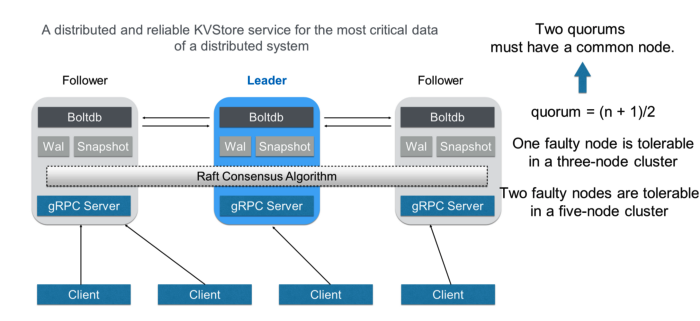

## 1. What is etcd?

> distributed reliable key-value store

:  `/etc` + `d`istributed system (*"엣-시디"로 읽음*)

- 분산 시스템의 운영에 필요한 데이터를 관리하는 용도로 사용된다.
- 클러스터 구성을 위해 election, consensus(Raft) 등을 처리하고 관련 설정값을 관리한다.
- CNCF(Cloud Native Computing Foundation) *Graduated* 프로젝트.
    - CNCF에서는 Coordination & Service Discovery 역할을 하는 프로젝트라고 소개됨.

### 1.1 History

**CoreOS Container Linux**를 관리하기 위해 개발되었다.

- 클라우드와 컨테이너에 최적화된 경량 리눅스 배포판 (약 100MB)
- 보안을 위해 자동으로 OS를 업데이트한다.
- read-only 루트 파일 시스템을 2개 생성하여 업데이트 후 교체하는 방법으로 OS를 라이브 업데이트한다.

- 그러나, RedHat에 인수된 후 2020.05 서비스 지원 종료되었다. (End of Service)
- 후속 버전들 : ***Fedora CoreOS** / **RHCOS***(RedHat CoreOS)
- RHCOS : OpenShift에 포함하기 위해 OCI를 지원하고 보안을 강화(SELinux 지원)

### 1.2 Features

**Simple Interface** : Read, Write는 JSON 포맷으로 HTTP를 통해 이루어졌다.

**Key-value storage** : 파일시스템처럼 계층화된 디렉토리에 데이터를 저장할 수 있다.

**Watch for Changes** : 특정 키나 디렉토리의 변경을 감시하다 변경에 react 할 수 있다.

- 인스턴스 당 1초에 1000건의 write 성능
- SSL을 통한 인증 기능
- Fully Replicated

- key에 TTL (Time-to-live) 적용 가능
- Raft 알고리즘을 통해 분산됨
- Highly Available

### 1.3 Used by


*외 AWS, Google, IBM, Alibaba 등 회사들의 다수 상용 프로덕션들.*

(kubernetes, ROOK, CoreDNS는 CNCF 프로젝트이므로 M3만 간단히 소개함)

**M3 (by Uber)**

\: a *Large-scale Time Series Metrics Platform for Prometheus*


**Components**

- ***M3DB*** : 분산 시계열 DB.
- ***M3 Collector*** : 애플리케이션으로부터 메트릭을 수집한다.
- **M3 Aggregator** : M3DB 노드에 메트릭을 저장하기 전에 stateful stream-based downsampling을 수행해 집계한다. 메트릭이 올바른 Aggregator 인스턴스로 라우팅되고, Aggregator 레플리카에 SPOF(Single Points of Failure)가 없도록 클러스터링과 레플리케이션을 지원한다.
- ***M3 Coordinator*** : M3DB 위에서 query, storage interface를 제공하는 Prometheus sidecar. M3DB와 Prometheus 사이에 존재하는 브릿지 역할.
- ***M3 Query*** : M3DB의 데이터를 쿼리하기 위한 분산 쿼리 엔진이다. 프로메테우스 호환 API를 제공하므로 Grafana와 같은 써드파티 솔루션도 사용 가능하다.

**etcd의 사용**

- M3 Aggregator는 클러스터링과 레플리케이션을 지원하는데, etcd의 election과 window tracking을 활용해서 이러한 상태를 관리한다.
- 또한, M3 Aggregator의 집계 기능은 etcd에 저장된 동적 규칙을 사용한다.
- M3 Coordinator에서도 etcd에 저장된 동적 규칙을 이용해 메트릭의 집계를 수행한다.

다른 분산 시스템에서 시스템을 관리하는 용도로 주로 사용하는 듯.

## 2. Architecture



([https://alibaba-cloud.medium.com/getting-started-with-kubernetes-etcd-a26cba0b4258](https://alibaba-cloud.medium.com/getting-started-with-kubernetes-etcd-a26cba0b4258))

- etcd의 백엔드 DB는 BoltDB로 구성되어 있다. Go로 작성되었으며, 빠르고 가벼운 Key-Value Store이다.
    - 공식 깃허브 [링크](https://github.com/boltdb/bolt)로 들어가보니 리포지토리가 아카이브 되었고, 17년을 마지막으로 더 릴리즈가 올라오지 않고 있다.

- etcd는 주로 3개의 노드나 5개의 홀수 개 노드로 구성되며, 노드들은 *Raft* 합의 알고리즘을 이용해 협력한다.
    - Quorum(정족수)은 ${n+1 \over 2}$로 설정되어, 5노드 클러스터에서 2개 노드에서 fail이 발생해도 fault-tolerant하도록 구성되었다.

- 클러스터에서 노드들은 *leader*와 *follower*로 구분되고, leader는 알고리즘에 따라 선출된다.
    - leader는 follower들을 관리하고, 클라이언트에서 들어온 요청을 수락하고 follower에게 포워딩한다.
    - 만약 leader에서 fail이 발생한다면, 자동으로 다른 노드를 leader로 선출한다.

### 2.1 Raft consensus algorithm

- 복잡한 Lamport의 Paxos 알고리즘보다 더 이해하기 쉽게 설계된 consensus 알고리즘이다.
    - **consensus** : 분산 시스템에서 노드들이 fault-tolerant하게 합의를 이루는 과정.
- Raft의 각 노드는 *Follower*, *Candidate*, *Leader*의 세 가지 state를 가지는 state machine이다.

**Raft consensus 과정 간단히 알아보기**


그림 $t_1$


그림 $t_2$

- **그림 $t_1$**은 클러스터의 초기 상태를 나타냄. 모든 노드는 Follower이고, 타이머를 가지고 있다.
    - 타이머는 Leader의 응답을 받지 못한 시간만큼 흘러가게 된다.
- 현재 Leader 노드가 없으므로, 먼저 timeout이 발생한 S2 노드가 Candidate로 전환되고 투표를 시작한다.
    - 초록색 메세지는 자신을 Leader로 투표해 달라는 메세지이고, 자신은 자동으로 찬성한다.


그림 $t_3$


그림 $t_4$

- 물론 $t_3$에서 보이듯이 S2가 시작한 투표가 끝나지 않은 상황에서 다른 노드도 투표를 시작할 수 있다.
- S2에 대한 투표를 다른 노드들이 찬성하고, 나중에 온 S4의 투표 메세지는 반대(*마이너스 표시*)한다.
    - S2가 Leader로 선출되고 나머지 Follower들에게 주기적으로 하트비트 메세지를 보낸다.
- 이 과정이 **Leader Election** 과정이었고, 이후에 분산 시스템은 Leader를 통해서 데이터를 처리하게 된다.

### 2.2 etcd API

- 21년 6월 현재 기준으로 etcd API의 최신 버전은 v3.5이고, 모두 gRPC 서비스로 제공된다.
- 각 노드에는 gRPC 서버가 있어서 클라이언트로부터 온 API 요청을 처리한다.

**etcd RPC의 서비스 기능에 따른 분류**

- **KV** : 키 밸류 쌍에 대한 Create, Update, Fetch, Delete 연산
- **Watch** : 키 변경에 대한 모니터링
- **Lease** : Primitives for consuming client keep-alive messages.

**etcd 클러스터를 관리하기 위한 서비스**

- **Auth** : role 기반 유저 인증
- **Cluster** : Provides membership information and configuration facilities.
- **Maintenance** : 리커버리를 위한 스냅샷, 저장소 조각모음, 멤버별 상태 정보 유지


[https://alibaba-cloud.medium.com/getting-started-with-kubernetes-etcd-a26cba0b4258](https://alibaba-cloud.medium.com/getting-started-with-kubernetes-etcd-a26cba0b4258)

**Data Model - Logical View**

- *flat binary key space*
- etcd는 데이터를 multi-version으로 저장한다.
    - 키의 버전은 1부터 시작하여 수정될 때마다 증가한다. 키가 삭제된 경우 버전을 0으로 재설정한다.

**Data Model - Physical View**

- etcd는 키 밸류 쌍을 ***B+ Tree***로 저장한다.
    - B+ Tree는 키를 사전 순으로 정렬하여 저장하므로, Range Query가 매우 빠르다.
- 효율성을 위해 새로운 리비전을 모두 저장하지 않고, 이전 리비전과의 차이(delta)만 기록한다.
- 또한 etcd는 키에 대한 Range Query를 빠르게 하기 위해 인 메모리 B Tree를 하나 더 둔다.
    - 이 B Tree에 있는 키는 유저에게 노출된다.

## 3. etcd in Kubernetes


- 쿠버네티스에서는 etcd를 클러스터의 데이터(설정 데이터, 클러스터 상태, 메타데이터 등)를 관리하는 용도로 사용한다.
    - etcd는 분산 환경에서 고가용성, consistency, fault-tolerance 등을 지원하므로 쿠버네티스의 백엔드로 사용하기 적합하다.
    - etcd의 `Watch` 기능은 키의 수정에 대한 모니터링을 제공하므로, 클러스터를 **선언한 상태(Desired State)**로 계속해서 유지하려 하는 쿠버네티스에 적합하다.

- 쿠버네티스에서 etcd를 접근할 때는 반드시 kube-apiserver를 통해서만 접근이 가능하다.

- kubectl 명령 등으로 쿠버네티스 클러스터의 데이터를 읽는 명령은 모두 etcd에 저장된 데이터를 읽어 제공된다.

    (예시로 kube-system 네임스페이스로 구동되고 있는 파드의 이름들을 출력해봤다.)

    - **kubectl 사용**

    ```bash
    $ kubectl get pods -n kube-system -o name

    pod/coredns-74ff55c5b-ksmcb
    pod/coredns-74ff55c5b-wjxnx
    pod/dragon-tf-operator
    pod/etcd-dnclab1-master
    pod/kube-apiserver-dnclab1-master
    pod/kube-controller-manager-dnclab1-master
    pod/kube-flannel-ds-22cdr
    pod/kube-flannel-ds-5lqc4
    pod/kube-flannel-ds-js4jq
    pod/kube-flannel-ds-ld9bs
    pod/kube-proxy-9nvqm
    pod/kube-proxy-ft77b
    pod/kube-proxy-hxlhd
    pod/kube-proxy-s6nbd
    pod/kube-scheduler-dnclab1-master
    pod/kube-state-metrics-5c544bc55-ffzpd
    pod/metrics-server-5f8ff9b957-bpdm5
    pod/nvidia-device-plugin-daemonset-1.12-9xcpn
    pod/nvidia-device-plugin-daemonset-1.12-pptfm
    pod/nvidia-device-plugin-daemonset-1.12-qnhxm
    ```

    - **etcdctl 사용**

    ```bash
    $ ETCDCTL_API=3 etcdctl --endpoints=localhost:2379 \
    		--cacert /etc/kubernetes/pki/etcd/ca.crt \
    		--cert /etc/kubernetes/pki/etcd/server.crt \
    		--key /etc/kubernetes/pki/etcd/server.key \
    		get /registry/pods/kube-system \
    			--prefix --keys-only

    /registry/pods/kube-system/coredns-74ff55c5b-ksmcb
    /registry/pods/kube-system/coredns-74ff55c5b-wjxnx
    /registry/pods/kube-system/dragon-tf-operator
    /registry/pods/kube-system/etcd-dnclab1-master
    /registry/pods/kube-system/kube-apiserver-dnclab1-master
    /registry/pods/kube-system/kube-controller-manager-dnclab1-master
    /registry/pods/kube-system/kube-flannel-ds-22cdr
    /registry/pods/kube-system/kube-flannel-ds-5lqc4
    /registry/pods/kube-system/kube-flannel-ds-js4jq
    /registry/pods/kube-system/kube-flannel-ds-ld9bs
    /registry/pods/kube-system/kube-proxy-9nvqm
    /registry/pods/kube-system/kube-proxy-ft77b
    /registry/pods/kube-system/kube-proxy-hxlhd
    /registry/pods/kube-system/kube-proxy-s6nbd
    /registry/pods/kube-system/kube-scheduler-dnclab1-master
    /registry/pods/kube-system/kube-state-metrics-5c544bc55-ffzpd
    /registry/pods/kube-system/metrics-server-5f8ff9b957-bpdm5
    /registry/pods/kube-system/nvidia-device-plugin-daemonset-1.12-9xcpn
    /registry/pods/kube-system/nvidia-device-plugin-daemonset-1.12-pptfm
    /registry/pods/kube-system/nvidia-device-plugin-daemonset-1.12-qnhxm
    ```

    글 초반에 서술했듯이 키는 계층적으로 저장되고 있으며, kube-system 네임스페이스를 나타내는 키 밑에 파드들의 키 또한 생성되어 있다. 조회하고 싶은 파드에 대한 키로 조회하면 해당 파드에 대한 설정을 얻을 수 있다.  
  
- 클러스터에 존재하는 파드에 대한 상태 정보는 `/registry/pods/{namespace}/{pod_name}` 키에 존재한다.
- 네임스페이스에 대한 정보는 `/registry/namespaces/{namespace}` 키에 존재한다.

- 이와 같이 etcd는 쿠버네티스 클러스터를 운영함에 있어 중요한 데이터들이 관리되고 있으므로, etcd의 백업 또한 매우 중요하다. (CKA 시험에서 필수로 나온다고 들었다)

## 4. vs other DBs

etcd는 key-value store이고 성능도 좋아보이는데, 다른 NoSQL 데이터베이스들을 아예 대체해서 사용할 수는 없을까?

- etcd는 메인 데이터베이스로 주로 쓰이는 MongoDB 등의 DBMS와 달리, 분산 시스템의 네트워크 장애 등 상황에서 한정된 양의 데이터를 보다 더 신뢰성 있게(reliable) 관리하는 것에 중점을 두고 개발되었다.
    - 메타데이터와 같은 작은 키밸류 쌍을 저장하는 것으로 설계되었기 때문에 요청은 최대 1.5 MiB로 한정되어 있다.
    - etcd 스토리지의 사이즈는 기본 2GB로 설정되어 있으며 권장되는 최대 사이즈는 8GB이다.

- 또한 안정성과 일관성을 위해 디스크에 데이터를 유지하므로, 어느정도 속도의 희생이 있다.

## References

**M3**

- [https://eng.uber.com/m3/](https://eng.uber.com/m3/)
- [https://medium.com/dataseries/uber-m3-is-an-open-source-large-scaltime-series-metrics-platform-d583aef37b07](https://medium.com/dataseries/uber-m3-is-an-open-source-large-scaltime-series-metrics-platform-d583aef37b07)

**etcd**

- [https://alibaba-cloud.medium.com/getting-started-with-kubernetes-etcd-a26cba0b4258](https://alibaba-cloud.medium.com/getting-started-with-kubernetes-etcd-a26cba0b4258)
- [https://www.ibm.com/cloud/learn/etcd](https://www.ibm.com/cloud/learn/etcd)
- [https://etcd.io/docs/v3.5/learning/data_model/](https://etcd.io/docs/v3.5/learning/data_model/)

**vs NoSQL**

- [https://stackoverflow.com/questions/41063238/using-etcd-as-primary-store-database](https://stackoverflow.com/questions/41063238/using-etcd-as-primary-store-database)
- [https://stackshare.io/stackups/etcd-vs-mongodb](https://stackshare.io/stackups/etcd-vs-mongodb)