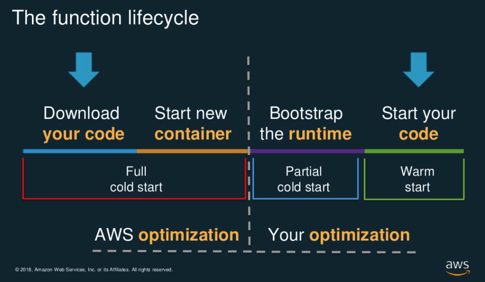
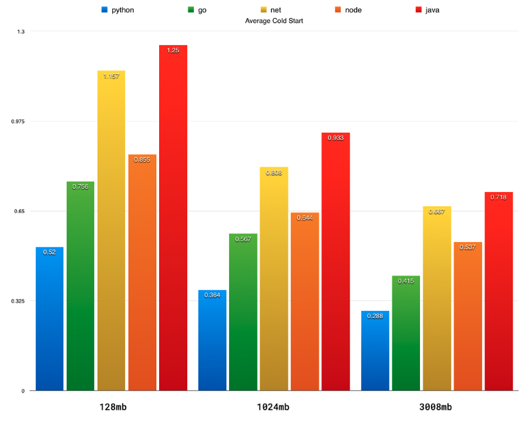
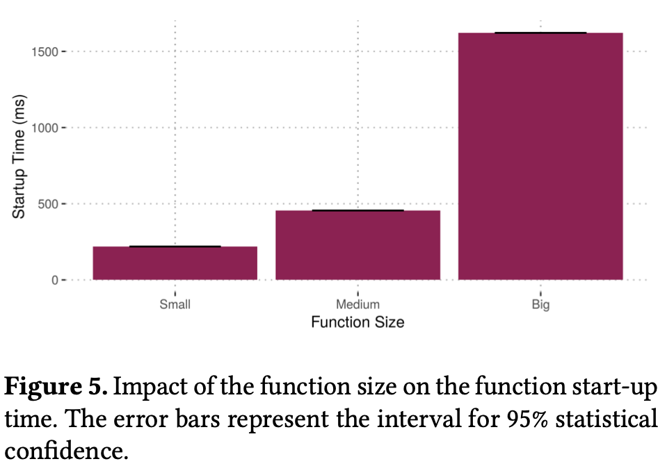

## 들어가기 전에

우선 서버리스는 문자 그대로 서버가 없다는 뜻은 전혀 아니다. **서버에 대해 고려를 할 필요가 없는** 구조라고 이해하는 것이 좋다. 서버리스라는 단어는 실제 이 아키텍처를 함축한 단어로는 적합하지 않고, 오히려 상술에 가까운 말이라고 생각한다. 다만 용어가 가지는 파급력과 간결함 때문에 논문에도 자주 등장하며 이 아키텍처를 표현하는 단어로 곧잘 사용되는 것 같다.

## 서버리스 아키텍처의 개념

우선 서버리스 아키텍처라는 개념에 대한 설명을 가져왔다.
redhat 홈페이지에선,
> 서버리스(Serverless)는 개발자가 서버를 관리할 필요 없이 애플리케이션을 빌드하고 실행할 수 있도록 하는 클라우드 네이티브 개발 모델이다.

매우 간단히 설명하긴 했는데, **개발자가 서버를 관리할 필요가 없다**는 가장 중요한 표현이 들어가 있다.

기존 *온프레미스(On-premise)* 환경이나 *IaaS(Infrastructre-as-a-Service)* 컴퓨팅 모델을 사용하는 경우에는 서버 프로그램을 빌드해서 계속 돌려두게 되는데, 이 경우엔 서버의 환경과 상태에 대해 지속적으로 신경써야 하고 관리를 해야한다.

반면에 서버리스 아키텍처는 서버의 환경 등 시스템, 인프라에 관련된 것은 대부분 추상화되어 제공된다. 개발자는 이러한 것을 고려할 필요 없이 비즈니스 로직에 집중하여 개발을 진행한다.

## FaaS (Function-as-a-Service)

서버리스 아키텍처는 *FaaS(Funtion-as-a-Service)*와 *BaaS(Backend-as-a-Service)*로 나뉘지만, 일반적으로 **서버리스**라고 하면 FaaS를 가리킨다.

프로그램을 함수 단위로 클라우드에 배포하고, 이벤트가 발생하면 함수가 실행되는 방법으로, 사용자는 함수가 실행된 횟수 및 시간에 따른 비용만 지불하게 된다.

이때, 이벤트는 웹 요청이 들어오면 발생시킬 수도 있고, 특정 시간 주기로 발생할 수도 있으며, 직접 호출할 수도 있음. 이를 이용해 웹과 같은 서비스에서 백엔드 API 서버를 구성할 수도 있다.

FaaS는 *AWS Lambda*, *Google Cloud Functions*, *Azure Function* 등의 서비스를 이용해 구축된다.

## FaaS의 특징

1. **Stateless**
 
    FaaS 서비스는 함수가 실행되는 동안에만 관련된 자원을 할당하게 됨. 또한 함수가 항상 같은 머신에서 실행된다는 보장이 없음. 따라서, 함수 실행 시 로컬에서의 어떤 상태(State)가 유지될 수 없다.

    이를 해결하고 싶다면 메모리에 상태를 저장하지 않고 AWS의 경우엔 S3을 이용하거나 아예 DB를 사용해야 한다.

2. **Ephemeral**

    위에서 말한 것과 같이 함수는 특정 이벤트가 발생했을 때만 컨테이너로서 배포가 되고, 실행이 끝난 후엔 자원이 회수되므로 일시적으로만 배포된다고 할 수 있다.

## 장점

- 서버 인프라에 대해 고려할 필요가 없음 (서비스에서 추상화되어 제공)

    ⇒ 신속한 개발 및 배포 가능

- 서버리스에 적합한 서비스들의 경우 비용을 획기적으로 줄일 수 있음 (서버를 24시간 소유하고 구동할 필요가 없음)
- 뛰어난 확장성

## 단점

- 인프라를 제공하는 회사(AWS, Google, MS 등)에 강하게 의존하게 됨

    ⇒ 인프라 변경 시 상당한 비용 발생

- 인프라가 제공되는 수준 이상으로 커스터마이징을 할 수 없음
- 서비스가 서버에 올라가 지속적으로 작업을 해야하는 경우에 적합하지 않음
- 대부분의 인프라 제공 회사에서는 함수의 실행에 대해 자원 제한을 걸어둠

## Challenge :: Cold Start 문제

계속 말했듯이 FaaS는 함수가 실행되는 동안만 관련된 자원이 할당되고, 실행이 끝난다면 자원은 회수된다. 물론 함수의 모든 실행마다 할당과 회수를 반복하지는 않는다. 자주 실행되는 함수의 경우 자원을 완전히 회수하지 않고 다음 실행에 대비하지만, 오래 호출되지 않은 함수의 경우엔 다음 실행에 대한 대비가 되어있지 않다. 그래서 가끔씩 함수를 호출할 때, 평소엔 응답까지 약 50ms가 걸리던 함수가 첫 실행에 한해 300ms까지 소요되는 상황이 발생한다. 이를 콜드 스타트 (Cold Start)라고 한다.

함수가 오랜만에 호출될 때 발생하는 응답 지연은 다음 이유들로 인해 발생한다.

- 함수를 실행하기 위해 자원을 프로비져닝하고 시작하는데 걸리는 시간 (가상머신이나 컨테이너 등)
- 함수의 런타임 환경을 구동 및 초기화하는데 걸리는 시간 (JVM이나 파이썬 인터프리터, Chrome V8 엔진 등)
- 함수 내 어플리케이션의 부트스트랩 시간 (라이브러리 컴파일과 로딩 등)

이를 최적화하는 방법은 많은 곳에 소개되어 있다. (자원을 할당하고 회수하는 한 완전한 해결은 불가능함)

  

먼저 AWS등과 같이 FaaS를 제공하는 업체에서 최적화를 해야하는 부분이 있다. 위의 자료 이미지에서 보듯이 코드를 다운받고 컨테이너를 새로 생성하는 등의 과정은 사용자가 해결할 수 있는 부분은 아니다. 이에 관해서는 한 논문을 소개하고 넘어가려 한다.

2020년 Middleware에서 발표된 Paulo Silva의 논문에서는 CRIU 툴을 이용해 함수가 실행되는 프로세스의 스냅샷을 백업/복원하여 속도를 향상시키는 방법을 제안했다.

  
그리고, [https://lumigo.io/aws-lambda-performance-optimization/](https://lumigo.io/aws-lambda-performance-optimization/) 에서 사용자가 최적화하는 몇가지 팁에 대해 소개하고 있다.

여기서는 함수의 구현 언어를 선택하는 것도 매우 중요하다고 한다.

다음 실험은 AWS Lambda에서 언어별 콜드 스타트를 테스트한 것이다. (2018년 기준)

  

아무래도 JVM을 구동해야 하는 자바가 더 큰 콜드 스타트 문제를 보여줬다.

또한 위에서 소개했던 Silva의 논문에서, 함수의 크기 (Function Size) 별로 함수의 start-up time을 비교한 이미지를 첨부한다.

  
함수의 크기가 크다면 그에 비례해서 콜드 스타트 문제도 더 크게 발생할 수 있으므로, 함수의 크기를 최대한 줄이는 것 또한 사용자가 할 수 있는 최적화의 한 방법이 될 수 있다.

## References

서버리스 개념 관련

- [https://www.redhat.com/ko/topics/cloud-native-apps/what-is-serverless](https://www.redhat.com/ko/topics/cloud-native-apps/what-is-serverless)
- [https://www.redhat.com/ko/topics/cloud-native-apps/what-is-faas](https://www.redhat.com/ko/topics/cloud-native-apps/what-is-faas)
- [https://cloudmt.co.kr/?p=3774](https://cloudmt.co.kr/?p=3774)

콜드 스타트 관련

- Paulo Silva, Daniel Fireman, and Thiago Emmanuel Pereira, 2020. *Prebaking Functions to Warm the Serverless Cold Start*. In *Middleware '20, December 7-11, 2020, Delft, Netherlands*. [https://doi.org/10.1145/3423211.3425682](https://doi.org/10.1145/3423211.3425682)
- [https://lumigo.io/aws-lambda-performance-optimization/how-to-improve-aws-lambda-cold-start-performance/](https://lumigo.io/aws-lambda-performance-optimization/how-to-improve-aws-lambda-cold-start-performance/)
- [https://lumigo.io/aws-lambda-performance-optimization/](https://lumigo.io/aws-lambda-performance-optimization/)
- [https://levelup.gitconnected.com/lambda-cold-starts-language-comparison-️-a4f4b5f16a62](https://levelup.gitconnected.com/lambda-cold-starts-language-comparison-%EF%B8%8F-a4f4b5f16a62)

이미지 출처
- [https://www.slideshare.net/AmazonWebServices/become-a-serverless-black-belt-optimizing-your-serverless-applications-aws-online-tech-talks/14](https://www.slideshare.net/AmazonWebServices/become-a-serverless-black-belt-optimizing-your-serverless-applications-aws-online-tech-talks/14)
- [https://levelup.gitconnected.com/lambda-cold-starts-language-comparison-️-a4f4b5f16a62](https://levelup.gitconnected.com/lambda-cold-starts-language-comparison-%EF%B8%8F-a4f4b5f16a62)
- Paulo Silva, Daniel Fireman, and Thiago Emmanuel Pereira, 2020. *Prebaking Functions to Warm the Serverless Cold Start*. In *Middleware '20, December 7-11, 2020, Delft, Netherlands*. [https://doi.org/10.1145/3423211.3425682](https://doi.org/10.1145/3423211.3425682)