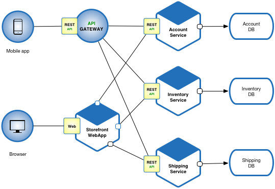
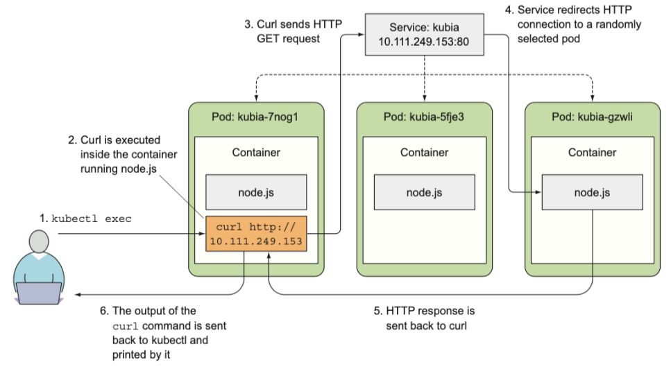

이 포스팅은 Marko Lukša의 Kubernetes in Action (1st edition)에서 *Chapter 5. Services: Enabling Clients to Discover and Talk to Pods*를 기반으로 재구성하였습니다.

서비스에 관련된 내용은 총 3편의 시리즈로 포스팅할 예정입니다.

- **쿠버네티스 서비스 1**
- [쿠버네티스 서비스 2](https://blog.frec.kr/cloud/service_2/)
- [쿠버네티스 서비스 : 인그레스](https://blog.frec.kr/cloud/service_ingress/) (작성 중)

---

## 1. 서비스(Service)의 등장 배경

먼저 서비스(Service)라는 쿠버네티스 리소스가 등장하게 된 배경을 살펴본다.

쿠버네티스 상에서 파드(Pod)는 기본적으로 격리되어 있다. 그러나 요즘 대부분의 어플리케이션은 외부의 요청에 결과값을 반환하길 원하고, 이를 위해서 파드들은 다음의 마이크로서비스 아키텍처 그림과 같이 다른 파드에 요청을 하기도 한다.

  

파드가 서로 격리된 상황에서, 파드는 다른 파드로 접근하기 위한 방법을 찾아야 한다. 쿠버네티스가 아닌 상황이었다면 시스템 관리자가 직접 각 서버의 IP로 접근하도록 할 수 있었겠지만, 쿠버네티스에서 이 방법은 좋은 방법이 아니다.

그 이유로 책에서는 다음 세 가지 이유를 들고 있다.

1. 파드는 **언제든지 생성되고 소멸**될 수 있는 존재다. (ephemeral)
2. 쿠버네티스가 파드에 IP를 할당할 때, 파드가 노드에 스케줄 되고 나서 시작되기 전에 IP가 할당된다. 때문에, 클라이언트가 **타겟 파드의 IP 주소를 알기 어렵다**.
3. 쿠버네티스의 스케일링은 파드의 수를 늘리는 걸 뜻하는데, 이때마다 할당되는 IP를 클라이언트가 매번 알게 하기는 힘들다.

이렇게 변화가 잦은 파드를 통해서 애플리케이션을 서비스하려면, 사실상 파드의 IP를 이용해 접근하는 것은 불가능에 가깝다는 것을 깨달았다. 클라이언트의 입장에서 생각해보면, 접근할 수 있는 **단 하나의 창구**를 원할텐데, 이런 배경에서 쿠버네티스는 *서비스(Service)*라는 리소스를 소개하고 있다.

## 2. 서비스

서비스는 같은 애플리케이션을 구동하는 파드들에 대해서, 변하지 않는 하나의 접근 포인트를 제공하는 것을 목표로 한다. 직접 바꾸지 않는 한 **변하지 않는 IP 주소와 포트를 노출**해서, 연결된 파드가 더 생기든 말든 클라이언트는 신경쓰지 않도록 한다.

프론트엔드와 백엔드로 나뉘어 쿠버네티스 상에 배포된 웹 서비스를 예시로 들어보겠다.

  

프론트엔드 파드는 사용자 로그인 웹 페이지를 제공하는 웹 서버로, 백엔드 파드를 로그인 로직을 처리하는 API 서버로 생각을 해보자. API 서버에서 문제가 생겨서 파드가 재시작되거나, 요청이 너무 많아져서 추가로 파드가 생성되었을 수 있다.

쿠버네티스에서 파드의 재시작은 새로운 파드를 생성하고 기존 파드를 삭제하는 방법으로 이루어지므로, **파드의 IP가 바뀔 것은 분명**하다.

백엔드 파드에 연결되는 서비스 리소스를 생성하면, 프론트엔드 파드에서는 서비스의 IP를 통해 파드에 일관되게 접근할 수 있다.

서비스의 생성은 `kubectl expose` 명령이나 서비스 YAML 파일을 통한 방법이 있다.

```bash
$ kubectl expose deployment api-server --name=api-service
```

`api-server`라는 이름의 Deployment와 연결되는 서비스를 생성하고, `api-service`라는 이름을 붙인다.

다만 YAML 파일에 명세를 작성하는 것이 kubectl 명령을 통해 생성하는 것보다 더 유연한 설정이 가능하기 때문에, 이 포스팅에서는 YAML 파일을 작성해 서비스를 생성한다.

```yaml
# api-service.yaml

apiVersion: v1
kind: Service
metadata:
	name: api-service
spec:
	selector:
		app: api-server
	ports:
	- port: 80
		targetPort: 8080
```

`metadata.name` 항목은 생성할 서비스의 이름을 뜻한다.

`spec.selector`의 `app: api-server`는 **서비스와 연결될 파드들을 식별**하는 용도의 *라벨 셀렉터(Label Selector)*이다. 파드에 app: api-server 라고 라벨이 붙어있으면, 이 서비스와 연결된다.

`spec.ports.port`는 서비스가 노출할 포트, `spec.ports.targetPort`는 연결할 파드의 포트를 뜻한다. 즉, {서비스의 IP}:80 → {파드의 IP}:8080 로 연결된다.

어떤 서비스들은 포트를 여러 개 오픈해야 할 수도 있다. 예시로, 80포트를 통해 HTTP 연결을 열고, 443 포트를 통해 동시에 HTTPS 연결을 열어야할 수 있다. 이 경우에는 `spec.ports` 하위에 다음과 같이 추가로 작성하면 된다. 물론 이 포트 항목에 대해 이름도 지정할 수 있다.

```yaml
# ...
ports:
	- name: http
		port: 80
		targetPort: 8080
	- name: https
		port: 443
		targetPort: 8443
# ...
```

이렇게 생성된 서비스는 `kubectl get svc` 명령으로 확인해볼 수 있으며, 가장 기본적인 서비스 타입인 *ClusterIP* 타입으로 생성되었다. 서비스의 타입은 다음이 있다.

1. ClusterIP 서비스
2. NodePort 서비스
3. LoadBalancer 서비스
4. Ingress (서비스의 타입은 아니고 서비스를 관리하는 리소스이다. 시리즈의 마지막에서 자세히 다룬다.)

ClusterIP, NodePort, LoadBalancer 타입에 대해서는 다음 포스팅에서 살펴본다.

## 3. 서비스에 접속하기

다음 그림은 책에서 제시하는 예시인데, 서비스에 연결된 백엔드 파드 중 하나에서 서비스에 curl로 요청을 보낸 상황이다.

`$ kubectl exec kubia-7nog1 —curl -s http://10.11.249.153`

  

이 그림에서 중요하게 볼 것은, 서비스 리소스에 요청이 들어갔을 때, 쿠버네티스의 프록시가 이 연결을 가로채서, **랜덤하게 선택된 백엔드 파드로 포워딩**해준다는 것이다.

이렇게 해서 지금까지 서비스에 대해 대략적으로 알아봤고, 백엔드 파드에 대해 접속할 수 있는 IP 주소와 포트를 얻었다. 다만 여기서 한 가지 의문이 생길 수 있다.

  

이전의 웹 서비스 예시에서, 백엔드 파드와 프론트엔드 파드는 서로 독립적으로 생성되었다. 그렇다면 프론트엔드 파드에서는 백엔드 서비스의 주소를 모르지 않을까? 프론트엔드 어플리케이션을 만들 때 백엔드 서비스의 IP와 포트를 지정을 해둬야 할까?

아무리 서비스의 IP가 바뀌지 않는다고 해도, 이렇게 IP를 하드코딩해두는 등의 방법은 우아하지 않은 선택인 것 같다.

역시 쿠버네티스는 다음 두 가지 방법을 제공함으로써 이런 고민을 하게 놔두지 않는다.

1. 각 파드에 서비스의 IP와 포트가 **환경변수**로 등록되어 있다.
2. 서비스에 접근할 수 있도록 **도메인 네임**을 제공한다.  
  

### 각 파드에 서비스의 IP와 포트가 **환경변수**로 등록되어 있다.

첫번째 환경변수부터 설명을 해보자면, 쿠버네티스가 파드를 시작할 때 그 시점에 존재하는 환경변수를 그 파드에도 설정한다.

  

책에서는 `kubectl exec` 명령으로 파드에 환경변수를 확인하는 명령을 전달하고 있다.

책에서 생성한 서비스의 이름이 `kubia`인데, kubia의 IP 주소와 포트가 KUBIA_SERVICE_HOST, KUBIA_SERVICE_PORT 환경변수로 등록되어 있는 것을 볼 수 있다.  
  

### 서비스에 접근할 수 있도록 도메인 네임을 제공한다.

쿠버네티스 클러스터를 구성하면 `kube-system` 네임스페이스에 ***CoreDNS***가 구동된다. 클러스터 내에서 발생한 DNS 쿼리는 CoreDNS를 통해서 쿠버네티스가 제어하게 된다.

각 파드들은 서비스의 이름만 알고 있다면 FQDN(Fully Qualified Domain Name)을 통해 서비스에 접근할 수 있고, 이 FQDN의 해석을 CoreDNS가 맡는다.

예시로, `default` 네임스페이스에 `api-service`라는 서비스가 생성되었다면, 다른 파드에서 이 서비스를 다음 도메인을 통해 접근할 수 있다.

`api-service.default.svc.cluster.local`

- `api-service`는 서비스의 이름을 뜻한다.
- `default`는 해당 서비스가 속한 네임스페이스이다.
- `svc`는 서비스를 뜻하며, 접근하고자 하는 리소스를 나타낸다.
- `cluster.local`은 클러스터 내에서 사용 가능한 최상위 도메인이다.

간단히 말하면, 접근하고자 하는 서비스의 이름과 네임스페이스만 안다면 이렇게 조합된 도메인을 통해 해당 서비스에 접근할 수 있게 된다.

이번 포스팅에서는 이렇게 서비스 리소스의 등장 배경과, 서비스의 생성, 서비스에 대한 접근 방법에 대해 살펴보았다. 다음 포스팅에서는 ClusterIP, NodePort, LoadBalancer 타입의 서비스에 대해 상세히 알아볼 예정이다.

---

### References

- [이미지 1] : https://microservices.io
- [이미지 2-5] : M. Lukša, Kubernetes in Action, Manning Publications, 2018.