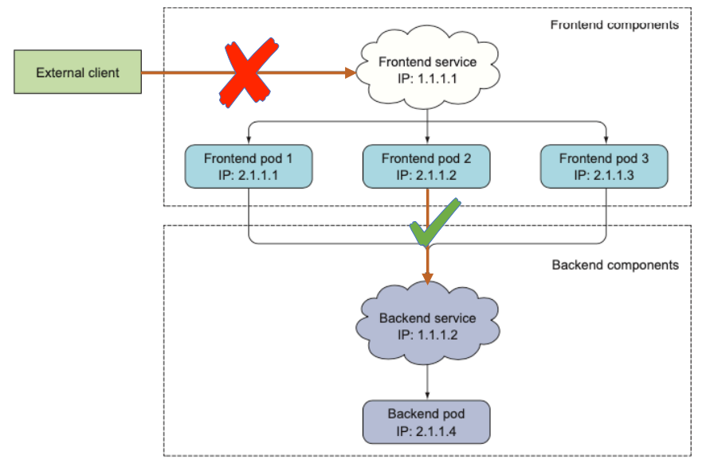
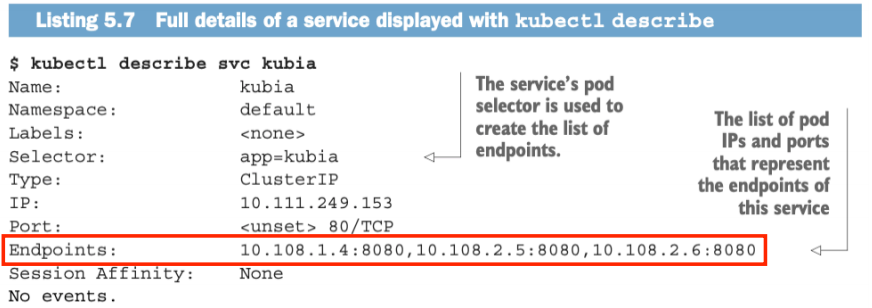
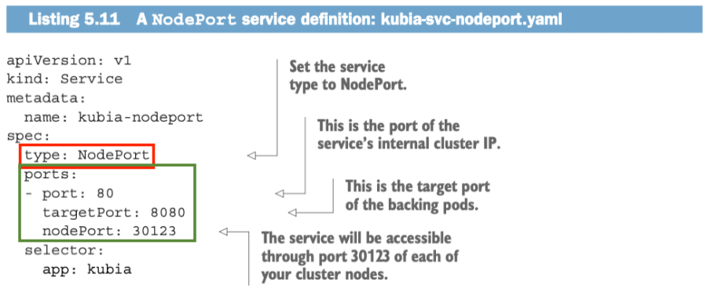
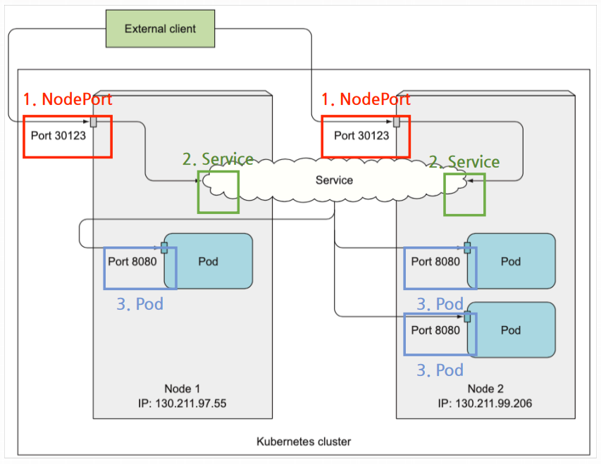
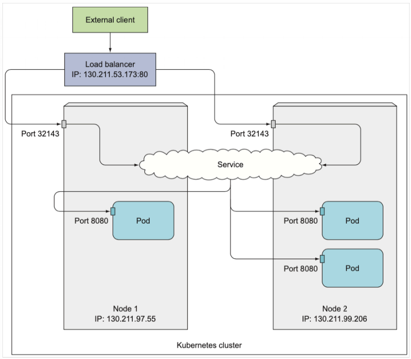

이 포스팅은 Marko Lukša의 Kubernetes in Action (1st edition)에서 *Chapter 5. Services: Enabling Clients to Discover and Talk to Pods*를 기반으로 재구성하였습니다.

서비스에 관련된 내용은 총 3편의 시리즈로 포스팅할 예정입니다.

## 들어가기 전에

지난 포스팅에서는 서비스라는 리소스에 대해 간략하게 알아봤고 가장 기본적인 서비스인 ClusterIP 타입의 서비스를 예시로 들었다. 다만 이 ClusterIP 타입은 이름에서도 알 수 있듯이 클러스터의 IP를 할당받는다. 다시 말하면, 서비스를 생성했는데 **이 서비스는 클러스터 내부에서만 접속이 가능**하다는 의미이다.

지난 포스팅에서 소개했던 서비스의 사용 예시 중에 웹 서비스 예시가 있었다. 웹 프론트엔드 파드가 있었고 이 파드들은 API 서버를 구동 중인 백엔드 파드에 요청을 하는 구조였다. 이 API 서버 파드들을 클러스터 내부에서 사용하기 위해서 ClusterIP 타입의 서비스를 통해 노출하는 것은 적절했다.

다만 웹 프론트엔드 서비스는 외부에서 클라이언트가 접근해야 할텐데, **ClusterIP 타입 서비스로는 클러스터 외부로 노출할 수 없다**는 단점이 있다. 다행히도 *NodePort* 타입, *LoadBalancer* 타입 서비스는 클러스터 외부로 노출이 가능하다.

따라서 이번 포스팅에서는 두 가지 타입의 서비스를 소개하고자 하고, 그 전에 서비스를 구성하는 ***엔드포인트(Endpoints)***라는 리소스와 그 확장 버전인 ***엔드포인트슬라이스(EndpointSlice)***에 대해 먼저 간단히 소개한다.

## 4. Endpoints 리소스

서비스와 파드는 우리가 생각하는 것처럼 직접 연결되어 있는 구조가 아니라, 실제로는 그 사이에 엔드포인트 리소스가 위치해서 관리한다고 한다.

책에서 생성한 서비스를 `kubectl describe` 명령을 통해 확인한 예시이다. 서비스 하위에 Endpoints라는 항목이 **서비스와 연결된 파드들의 IP와 포트를 리스트 형태**로 가지고 있다. 쿠버네티스는 서비스에 요청이 들어오면 이 엔드포인트 중 하나로 리다이렉트한다.

쿠버네티스에서는 서비스와 엔드포인트의 연결 관리를 프록시 모듈에서 수행하고 있다. (`/pkg/proxy/endpoints.go`)

## 5. EndpointSlice 리소스

엔드포인트 리소스는 위에서 언급한대로 서비스와 연결된 파드의 IP, 포트를 가지고 있다. 다만 쿠버네티스 클러스터에서 서비스가 초창기 설계보다 더 많은 수의 파드로 더 많은 트래픽을 전송하는 방향으로 성장함에 따라, 엔드포인트 리소스가 처리할 수 있는 한계에 도달했다고 한다. [1]

서비스에 연결된 모든 네트워크 엔드포인트가 한 엔드포인트 리소스에 연결되다보니 엔드포인트가 변경될 때 성능에 큰 영향을 미쳤다고 공식 문서에서 표현하고 있다.

엔드포인트슬라이스는 **기존의 엔드포인트를 포함**하는 형태로 한 단계 더 추상화된 리소스이다. 기본적으로 엔드포인트슬라이스는 각각 100개 이하의 엔드포인트를 가지도록 관리된다.

## 6. NodePort 타입 서비스

이제 NodePort 타입의 서비스를 이용해서 클러스터 외부로 서비스 리소스를 노출하는 방법에 대해 알아보고자 한다. 

NodePort 타입은 기본형 서비스였던 **ClusterIP 타입 서비스를 기반**으로 하고 있다. ClusterIP 타입 서비스가 생성되고 이 서비스를 노드(Node)의 특정한 포트와 연결한다. 예시로, NodePort를 30123으로 설정한다면 **클러스터를 구성하고 있는 모든 노드**의 30123 포트와 서비스가 연결된다.

책에서 제시하는 NodePort 타입 서비스의 YAML 파일 예시인데, 타입이 ClusterIP에서 NodePort로 설정된 것과, `spec.ports` 항목에서 `nodePort` 값이 추가된 것 정도가 변경된 점이다. 만약 `nodePort` 항목을 설정하지 않는다면 쿠버네티스가 **30000-32767** 범위 내에서 자동으로 할당할 것이다. 이 범위는 *kube-apiserver*의 설정을 바꿈으로써 변경할 수 있다. (방법에 대해서는 [7월 23일 포스팅](https://blog.frec.kr/cloud/modify_nodeport_range/)을 참고)

위의 YAML 파일을 통해 생성된 NodePort 서비스로 요청이 들어올 경우, 연결된 파드로 라우팅되는 과정은 다음 그림과 같을 것이다.

간단히 표시하면 **{클라이언트} → {노드IP:노드포트} → {ClusterIP:포트} → {파드IP:포트}** 의 구조이다.

이 서비스의 ClusterIP가 `10.11.254.223`으로 할당되었다고 가정하자. (NodePort 서비스는 ClusterIP 서비스 위에서 구현되었으므로 ClusterIP가 할당된다.) 우리는 이 서비스에 다음과 같이 접속할 수 있다.

- 10.11.254.233 : 80 **(클러스터 내부)**
- 130.211.97.55 : 30123 **(클러스터 외부)**
- 130.211.99.206 : 30123 **(클러스터 외부)**

첫번째 주소는 내부에 생성된 ClusterIP 서비스의 주소이다. 물론 클러스터 내부에서만 접속할 수 있다. 두번째 주소와 세번째 주소는 각 노드의 IP와 포트이다. 이를 통해 클러스터 외부에서 접속할 수 있다.

## 7. LoadBalancer 타입 서비스

LoadBalancer 타입 또한 클러스터 외부에서 접속할 수 있으며 **NodePort 타입 서비스를 확장**하여 구현되었다. NodePort 서비스가 ClusterIP 서비스를 기초로 하고 있기 때문에 이 LoadBalancer 서비스 또한 ClusterIP와 NodePort가 모두 설정된다.

구글 클라우드 플랫폼(GCP), 아마존 웹 서비스(AWS), 마이크로소프트 Azure 등 상용 클라우드 서비스를 이용하는 경우, 이 클라우드 프로바이더들이 제공하는 로드 밸런서(Load Balancer)를 사용할 수도 있을 것이다.

쿠버네티스에서는 이러한 **외부 로드 밸런서를 서비스 리소스와 연결**할 수 있도록 LoadBalancer 타입 서비스를 지원한다. 

LoadBalancer 서비스를 사용한 구조는 다음과 같다.

위에서 소개했던 NodePort의 구조와 거의 유사하나 한 가지 컴포넌트가 추가됐다. 외부 로드 밸런서가 NodePort 서비스의 위에서 동작하는데, 이는 외부에서 접속 가능한 단일 IP와 포트를 클라우드 프로바이더로부터 할당받아 사용한다.

클라이언트에서 외부 로드밸런서, 즉 130.211.53.173:80로 요청을 보내면 로드 밸런서는 NodePort를 통해 서비스로 요청을 리다이렉트한다. 현재 서비스의 처리량을 상회할만큼의 많은 요청이 들어오면 로드 밸런서는 설정된 정책에 따라 라우팅할 노드를 선택하는 등 부하 분산을 수행한다.

## 마치며

이번 포스팅에서는 서비스와 연결된 *엔드포인트(Endpoint)*와 *엔드포인트슬라이스(EndpointSlice)*를 알아보았고, 서비스의 다른 타입인 *NodePort*와 *LoadBalancer*에 대해 살펴봤다. 두 타입의 서비스를 통해 이전 포스팅에서는 불가능했던 **서비스의 클러스터 외부 노출**을 가능하게 만들었다. 그러나 이들은 **L4 계층(네트워크 계층)에서 TCP, UDP 패킷**을 다룬다.

다음 포스팅에서는 서비스보다 한 단계 더 추상화된 리소스로, **L7 계층(애플리케이션 계층)에서 HTTP 패킷을 로드밸런싱**을 수행하는 Ingress라는 리소스에 대해 살펴볼 예정이다.

---

### References

- [1] [https://kubernetes.io/ko/docs/concepts/services-networking/endpoint-slices/](https://kubernetes.io/ko/docs/concepts/services-networking/endpoint-slices/)
- [이미지 1-5] M. Lukša, Kubernetes in Action, Manning Publications, 2018.