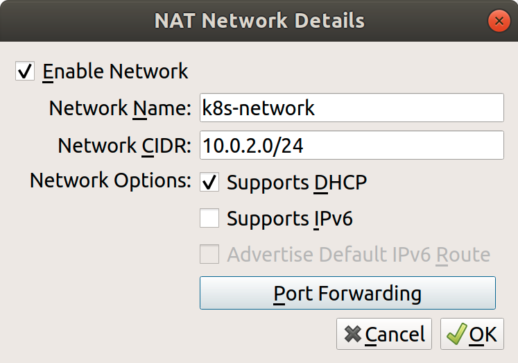
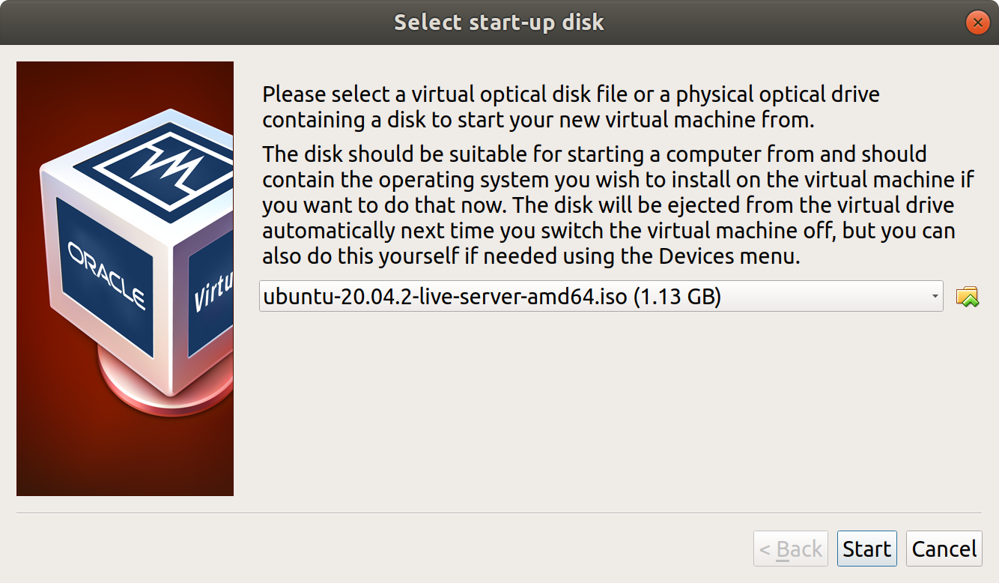
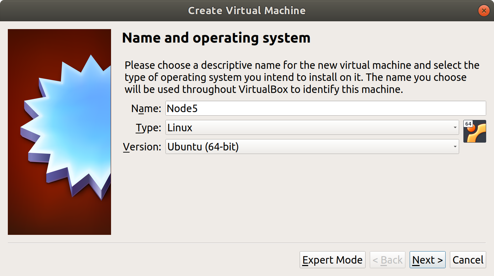
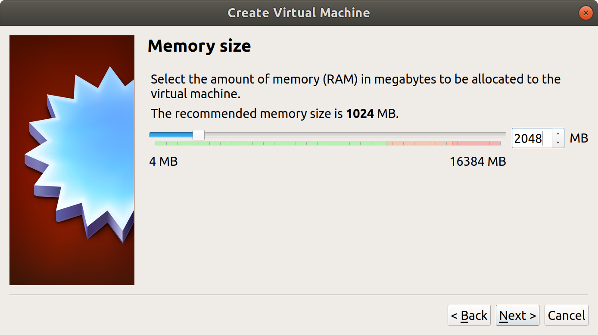
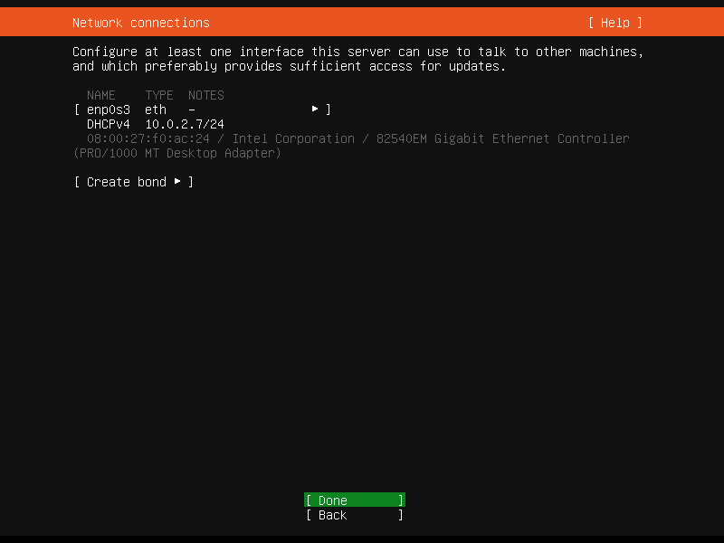
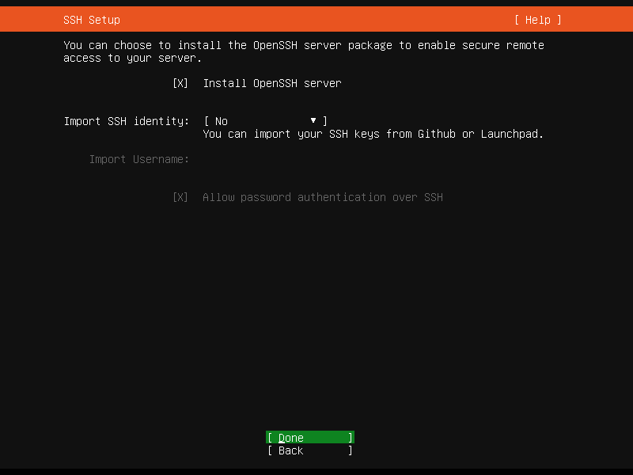
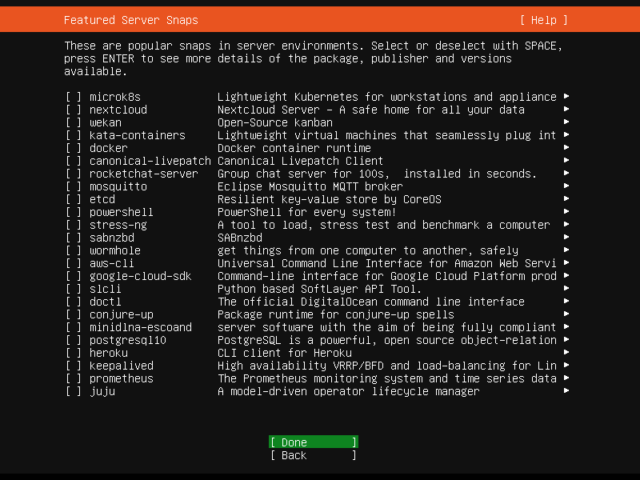
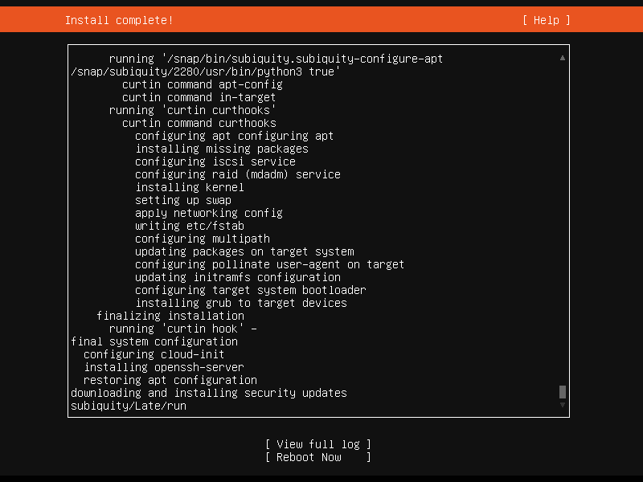
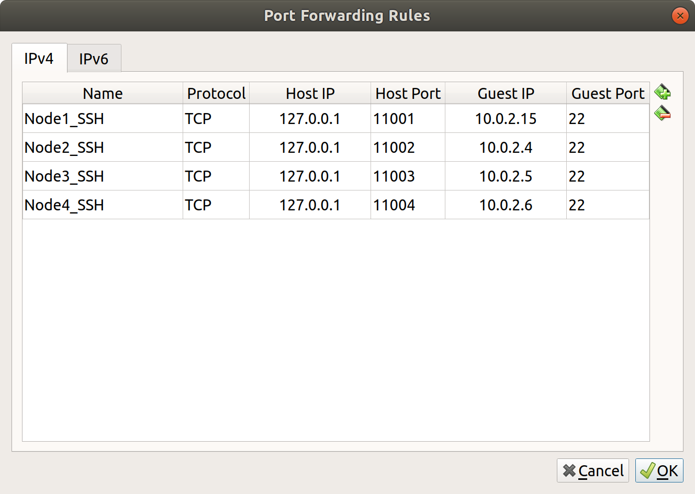

## 환경

**호스트 서버**

- Ubuntu 18.04
- VirtualBox

**VirtualBox 가상머신 * 4ea**

- vCPU 2ea, RAM 2GiB
- Ubuntu Server 20.04

## VirtualBox 설치

```bash
$ sudo apt update
$ sudo apt install -y virtualbox
$ sudo apt install -y virtualbox-ext-pack
```

## VirtualBox로 가상머신 생성

VirtualBox를 켜고, 먼저 각 노드들이 연결될 가상 네트워크를 하나 생성할 것이다.

VirtualBox 화면에서 상단 메뉴의 File > Preferences를 눌러 설정화면으로 들어가서 Networks 탭으로 들어간다. 우측의 네트워크 추가 버튼을 눌러 다음과 같이 설정한다. (10.0.0.0/8 대역은 사설 IP 대역이다.) 

  

이렇게 가상네트워크를 만들고 가상머신 생성을 시작한다. 이미지는 [우분투 20.04 서버 이미지](https://ubuntu.com/download/server)를 사용했다.

  

  

쿠버네티스 노드는 메모리가 2GB 이상으로 설정되어야 한다고 한다.

  

하드디스크 설정 등을 거쳐 가상머신이 생성되면 실행해본다. 가상머신이 시작될 디스크를 선택하라는 메세지가 나오는데, 다운받았던 우분투 서버 이미지 파일(`.iso`)을 선택해서 부팅한다.

  

가상머신이 부팅되었고 우분투 환경 세팅이 시작된다. 가상머신이 할당받은 IP를 우선은 기록해둔다.

  

프로필 세팅을 거치고, OpenSSH 서버를 설치할 것인지를 묻는데 체크해줬다.

  

우분투가 추가적으로 서버용 툴들 설치할지 확인하고 있다. 어차피 도커를 설치해야 하니 여기서 docker를 선택했었는데, 여기서 설치하면 `snap`으로 설치되기 때문에 `apt`로 설치한 도커와 설치 위치가 달라져 나중에 쿠버네티스 설치가 조금 힘들었다. 그냥 취소하고 자신의 방법대로 **우분투 설치 완료 후 설치**하자.

  

다음 화면이 나오면 우분투 서버 20.04 설치 완료! 가상머신을 재부팅한다.

  

지금 생성된 가상머신을 마스터 노드로 사용하고, 워커 노드로 사용할 가상머신을 3개 더 만들자. 지금 했던 과정을 3번 더 반복하고, 각 노드의 이름만 `node1`, `node2`등으로 설정해주었다.

(나중에 보니 VM 화면에서 가상머신을 우클릭하고 복제를 누르면 된다. 물론 복제 후 노드 이름은 변경해줘야 한다.)

## 가상머신 포트포워딩

호스트에서 가상머신들에 SSH 접속을 하기 위해서 포트포워딩 설정을 해줘야 한다.

VirtualBox 화면에서 상단 메뉴의 Files > Preference를 클릭, Network 탭으로 가서 이전에 만들어두었던 NAT Network를 수정한다.

Port Forwarding 버튼을 누르고 다음 화면처럼 세팅한다.

  

이제 각 노드는 다음 명령을 통해 접속할 수 있다.

```bash
$ ssh -p 11001 node@127.0.0.1 # Node1
```

자주 접속을 하게 될 것 같아서 호스트의 `~/.ssh/config` 파일을 다음과 같이 수정했다.

```
Host node1
	HostName 127.0.0.1
	User node
	Port 11001

Host node2
	HostName 127.0.0.1
	User node
	Port 11002

Host node3
	HostName 127.0.0.1
	User node
	Port 11003

Host node4
	HostName 127.0.0.1
	User node
	Port 11004
```

```bash
$ ssh node1
```

## 각 노드에 Kubernetes 설치

먼저 도커부터 설치한다.

```bash
$ curl -fsSL https://get.docker.com/ | sudo sh
```

도커가 설치되면 `systemctl status docker` 명령을 통해 서비스가 동작하고 있는지(*running*) 확인하고 쿠버네티스를 설치한다.

```bash
$ sudo apt update && sudo apt upgrade
$ curl -s https://packages.cloud.google.com/apt/doc/apt-key.gpg | sudo apt-key add -

$ cat <<EOF | sudo tee /etc/apt/sources.list.d/kubernetes.list
deb https://apt.kubernetes.io/ kubernetes-xenial main
EOF

$ sudo apt update
$ sudo apt install -y kubelet kubeadm kubectl
```

쿠버네티스는 **Swap이 설정된 머신에서는 동작하지 않고 에러**를 낸다. Swap이 설정되어 있으면 pod들이 일관적인 성능을 내는 것을 보장할 수 없다고 한다. 쿠버네티스 개발진은 이를 해결할 수는 있지만, **해결해서 얻는 이득이 딱히 크지 않다**고 판단해 우선순위를 뒤로 미뤄둔 것 같다.

다음 명령을 통해 swap을 영구적으로 비활성화한다.

```bash
$ sudo swapoff -a
$ sudo sed -i '/ swap / s/^\(.*\)$/#\1/g' /etc/fstab
```

쿠버네티스 실행에 앞서 한 가지 더 필요한 설정이 있는데, **쿠버네티스와 도커의 cgroup 드라이버가 동일해야 한다**는 것이다. 도커의 cgroup 기본 드라이버는 `cgroupfs`인데, 쿠버네티스에서 권장하는 드라이버는 `systemd`라고 한다.

우선 도커의 cgroup 드라이버를 확인해보자.

```bash
$ sudo docker info | grep -i cgroup

# output
...
Cgroup Driver: cgroupfs
...
```

다음 명령들을 통해 드라이버를 변경하고, 도커 서비스를 재시작한다.

```bash
# 권한 부여
$ sudo chown $USER:docker /etc/docker

# 도커 대몬 교체
cat > /etc/docker/daemon.json <<EOF
{
  "exec-opts": ["native.cgroupdriver=systemd"],
  "log-driver": "json-file",
  "log-opts": {
    "max-size": "100m"
  },
  "storage-driver": "overlay2"
}
EOF

$ sudo mkdir -p /etc/systemd/system/docker.service.d

# 도커 서비스 재시작
$ sudo systemctl daemon-reload
$ sudo systemctl restart docker
```

## kubeadm 이용해서 클러스터 구성

kubernetes.io에 따르면 kubeadm은 **쿠버네티스 클러스터 생성 용도의 툴**로, 시스템 프로비저닝까지 다루지 않고 부트스트랩(bootstrapping)까지만 다루도록 설계되었다고 한다.

여기서는 kubeadm을 이용해 클러스터를 구성할 것이다. 

마스터 노드에서 다음 명령을 입력해 클러스터를 구성한다.

(물론 kubeadm init 명령에서 IP는 자신이 세팅한 마스터 노드의 IP로 설정한다.)

```bash
$ sudo kubeadm init --apiserver-advertise-address=10.0.2.15

$ mkdir -p $HOME/.kube
$ sudo cp -i /etc/kubernetes/admin.conf $HOME/.kube/config
$ sudo chown $(id -u):$(id -g) $HOME/.kube/config

# root 권한으로 설정
$ export KUBECONFIG=/etc/kubernetes/admin.conf
```

마스터노드에서 `kubeadm init` 명령이 완료되면 그 클러스터로 참가할 수 있는 명령이 출력된다. 이 명령을 워커 노드에서 입력해야 하므로 복사해둔다.

```bash
$ sudo kubeadm join 10.0.2.15:6443 --token 8rzhrw.av7q1aoyqwsco3q --discovery-token-ca-cert-hash sha256:3be2271256e896a6762f7b39a69f38c990cafbfd39ab92c01df6fdbf4bfc3d9
```

`Calico`와 `Flannel`이라는 두 가지 애드온을 설치한다. 마스터 노드에서 입력하자. 이 둘은 CNI(Container Network Interface) 플러그인으로, **기본 쿠버네티스 자체적으로는 pod간 통신을 위한 네트워크를 구성해주지 않기 때문**에 추가로 설치해 사용하게 된다.

```bash
$ sudo kubectl apply -f https://docs.projectcalico.org/v3.8/manifests/calico.yaml
$ sudo kubectl apply -f https://raw.githubusercontent.com/coreos/flannel/master/Documentation/kube-flannel.yml
```

이제 마스터 노드의 설정이 끝났고, 위에서 복사해둔 `kubeadm join` 명령을 각 워커 노드에서 실행하면 클러스터 구성이 완료된다.

워커들이 클러스터에 제대로 참여했는지 마스터 노드에서 확인해보자.

```bash
$ sudo kubectl get nodes

# output
NAME    STATUS   ROLES                  AGE   VERSION
node1   Ready    control-plane,master   40m   v1.20.4
node2   Ready    <none>                 21m   v1.20.4
node3   Ready    <none>                 21m   v1.20.4
node4   Ready    <none>                 21m   v1.20.4
```

## Troubleshooting

이번 포스팅에서 다룬 가상머신으로 클러스터 구성한 것과, 연구실 서버로 클러스터 구성하면서 해결한 몇몇 에러를 소개한다. 아직 쿠버네티스 실력 수준이 낮고, 복잡한 클러스터를 다뤄보지 못해서 이 정도 에러만 소개하고 포스팅을 마치려 한다.

### 워커 노드들의 Status가 전부 NotReady로 뜨는 경우

Calico와 Flannel 애드온 설정을 빼먹어서, 진행해줬더니 Ready 상태로 변경되었다.

### kubelet 서비스가 실행되지 않는 경우

마스터 노드에서 클러스터에 계속 접속이 되지 않아 kubelet 서비스가 제대로 동작하고 있는지 확인을 해봤다.

```bash
$ sudo systemctl status kubelet
```

보통 때면 초록색으로 active (running)이 표시될텐데 그렇지 않았다.

이 상황은 세 번을 겪었는데, <ins>한 번은 도커가 실행되지 않고 있던 경우</ins>, 도커는 실행되었지만 <ins>도커와 쿠버네티스의 cgroup 드라이버가 서로 맞지 않던 경우</ins>, 마지막으로 <ins>머신에 swap이 켜져있던 경우</ins>였다.

journalctl 명령을 통해 kubelet 서비스의 로그를 먼저 확인해서 각 경우를 해결했다.

도커와 쿠버네티스 cgroup 드라이버가 일치하지 않던 경우는 위에서 했던대로 도커의 드라이버를 변경해주고 서비스를 재시작하면 바로 해결되었다.

swap이 켜져있던 경우도 위에서 설정했던대로 다시 swap을 꺼주었다. swap을 비활성화하는 `swapoff -a` 명령만 수행했더니 영구적으로 적용되지 않아 머신이 재부팅한 후에 swap이 다시 활성화됐던 것이었다. 그 밑의 명령까지 수행하자.

도커가 실행되지 않던 상황은, /etc/docker/daemon.json 파일이 어떤 이유로 비워졌기 때문이었다. cgroup 드라이버 변경할 때 넣었던 내용을 다시 입력해주었다.

## References

- VirtualBox 설치 : [https://phoenixnap.com/kb/install-virtualbox-on-ubuntu](https://phoenixnap.com/kb/install-virtualbox-on-ubuntu)
- Swap을 꺼야하는 이유 : [https://github.com/kubernetes/kubernetes/issues/53533](https://github.com/kubernetes/kubernetes/issues/53533)
- kubeadm : [https://velog.io/@seunghyeon/Kubeadm으로-K8S-구성](https://velog.io/@seunghyeon/Kubeadm%EC%9C%BC%EB%A1%9C-K8S-%EA%B5%AC%EC%84%B1)
- 가상머신 구성 : [https://velog.io/@evanjin/kubernetes-virtualbox를-이용하여-설치mac-ijk495l4e9](https://velog.io/@evanjin/kubernetes-virtualbox%EB%A5%BC-%EC%9D%B4%EC%9A%A9%ED%95%98%EC%97%AC-%EC%84%A4%EC%B9%98mac-ijk495l4e9)
- Calico, Flannel : [https://jonnung.dev/kubernetes/2020/02/24/kubernetes-pod-networking/](https://jonnung.dev/kubernetes/2020/02/24/kubernetes-pod-networking/)


수정사항
- 2021.03.09 13:48 :: calico, flannel 설치 명령 오타 수정