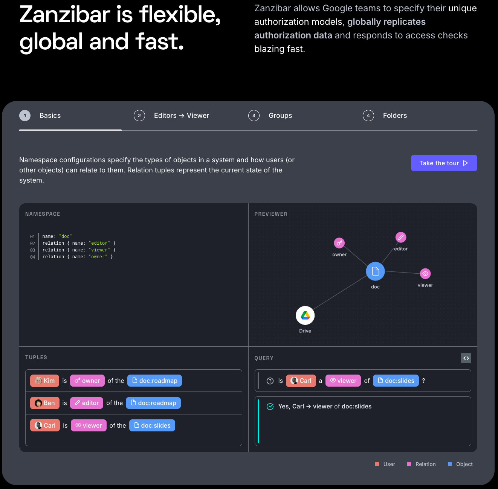
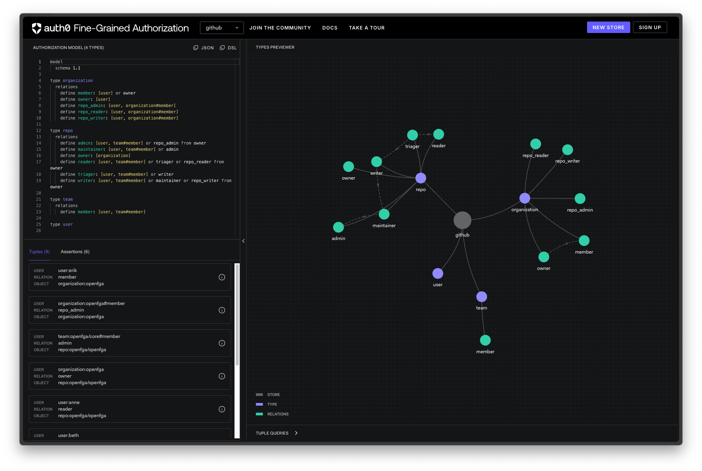

## 1. OpenFGA

OpenFGA는 유저-리소스 간 관계 기반의 접근 제어를 수행한다.

시스템이 복잡해짐에 따라 Authorization 모델 또한 복잡성이 증가할 수 있다. 전통적으로 사용하는 RBAC 및 ABAC은 단순하고 빠르게 모델을 세우고 구현할 수 있지만, 리소스가 복잡한 계층으로 구조화되어 있거나 사용자 간 관계에 따라 접근을 제어해야 하는 등의 상황에서 한계를 보인다.

구글에서는 역할 기반, 속성 기반이 아닌 현실 세계의 관계를 기반으로 권한을 evaluate하는 새로운 접근 제어 시스템을 시도했다. 이는 Zanzibar라는 이름으로 구현되어, 여러 구글 서비스를 넘나들며 수문장 역할을 한다.

다만 Zanzibar는 구글 내부에서만 사용되고 외부로는 컨셉에 대해서 논문[1]으로만 공개되었다. [Auth0](https://auth0.com/)는 이에 영감을 받아 [OpenFGA](https://openfga.dev)라는 오픈소스를 개발해 공개했고 CNCF 샌드박스 프로젝트가 되었다. Zanzibar에 영감을 받은 프로젝트로는 [Carta](https://carta.com/sg/en/), [Ory Keto](https://www.ory.sh/keto), [AuthZed](https://authzed.com/) 가 있고 이번 포스트는 OpenFGA를 사용해보고자 한다.

추가로, FGA는 Fine-Grained Authorization의 약자이며, 이름만큼 세세한 Authorization을 지원한다.

### 1.1 Zanzibar에 대해 조금만 더!


[https://kilimanjarobound.com/zanzibar-beach-holidays/](https://kilimanjarobound.com/zanzibar-beach-holidays/)

구글에서 발표한 논문에 따르면 Zanzibar는 구글 캘린더, 클라우드, 드라이브, 지도, 사진, 유튜브 등 서비스에서 내부적으로 사용된다. 구글 드라이브만 생각해봐도 엄청난 수의 유저가 더 엄청난 수의 파일을 관리하고, 심지어는 다른 유저에게 뷰어/에디터/오너 권한을 주어 공유까지 한다. 유저와 리소스 간의 상호작용 뿐만 아니라 드라이브에 있는 파일을 메일에 첨부하여 공유하는 것처럼, 구글 서비스의 리소스는 서비스를 가리지 않고 사용될 수 있다. 이렇게 복잡도가 높은 시스템에서 정적인 권한을 생성하고 유저에게 부여하는 방법을 사용하는 것은 확실히 어렵겠다는 생각이 든다.

구글은 현재(아마도 2018년 기준) Zanzibar가 2조개 이상의 ACL (Access Control List)를 다루고 초당 수백만의 권한 체크가 이루어지고 있다고 한다. 또한 구글은 전세계를 대상으로 서비스를 하므로 세계 각지에서 오는 권한 체크 요청을 처리해야 하는데, Zanzibar는 최근 3년간 95% 이상의 요청을 10ms 내에 처리했다고 한다.

Auth0에서 이 Zanzibar 컨셉에 대해 시각적으로 쉽게 설명해주는 [zanzibar.academy](https://zanzibar.academy/) 사이트를 만들었으니 참고하는 것도 좋다.



### 1.2 ReBAC ?

Zanzibar 페이퍼에서는 딱히 등장하는 단어는 아닌데, OpenFGA 측에서는 이에 영감받은 서비스를 RBAC과 차별을 두기 위해 **ReBAC**이라고 소개한다. Relation-Based Access Control 이라는 뜻으로, 유저와 오브젝트 간 관계를 모델링한 것을 기반으로 접근 규칙을 만든다. [2] 다만 OpenFGA 문서에서 ReBAC이 RBAC을 포함하는 상위 개념으로 소개한다.

<br>

RBAC 시스템에서 유저는 특정 "역할(Role)"을 가지고, 역할에는 "권한(Permission)"이 부여된다. 즉 유저가 어떤 리소스에 접근하려면 **"그 리소스에 접근 권한이 있는 역할을 유저가 가지고 있는가?"** 라는 질의가 선행된다. ReBAC에서의 권한 질의는 **"유저 $U$가 오브젝트 $O$와 관계 $R$을 가지고 있는가?"** 형태이다. 예를 들어 구글 드라이브에서 유저 freckie가 문서 $A$을 수정하고 싶을 때, RBAC에서는 "**수정 권한을 가진 역할을 freckie가 가지고 있는가?"** 를 확인한다. ReBAC에서는 "**유저 freckie가 문서 $A$와 editor 관계인가?"** 를 확인한다. 

또한 이 관계는 **계층구조**로 설정하거나 **상속**이 가능하다. 폴더 $F$에 문서 $A$가 포함되는 관계일 때 유저 freckie가 폴더 $F$와 _editor_ 관계라면, 유저 freckie와 문서 $A$는 _editor_ 관계이다. 이처럼 리소스 타입이 복잡해지고 시스템이 커질수록 ReBAC이 조금 더 현실 세계에 가까운 설계가 아닌가 싶다.

<br>

그렇다면 ReBAC 시스템은 언제 쓰면 좋을까? 물론 기존 개발자에게 RBAC이 더 익숙하고 구현하기 더 간단하니 웬만한 시스템은 RBAC으로 커버가 가능할 것으로 생각한다. 어떤 상황에서 ReBAC 설계가 이점을 가질까 LLM에 슬쩍 물어봤는데 대체로 공감되는 답을 얻었다.

- RBAC 모델이 너무 단순해 비즈니스 로직에 맞지 않을 때
- 리소스나 유저 수가 폭발적으로 늘어났을 때
- 권한을 상속하거나 공유 혹은 위임을 해야할 때
- Multi-tenant 환경에서 유연하게 권한을 제공해야 할 때

이해를 위해 "특정 문서에 대해 편집이 가능해야 하는" 구글 드라이브 예시를 생각할 수 있을 것 같다. 

"editor_role" 라는 역할을 만들어 유저에게 주는 정도로는 구현이 불가능해서, 속성 기반으로 편집 가능한 사람을 처리해 준다든지 추가적인 로직이 필수적이다. ReBAC에서는 유저와 문서 간 _editor_ 관계만 설정한다면 이 관계가 존재하는지만 질의하면 쉽게 구현이 가능하다.

또한 리소스 수와 유저 수가 많아진다면 폴더→문서 등 계층구조로 모델링하여 권한을 상속, 공유 등이 가능하다.

만약 멀티 테넌트 환경의 SaaS를 구현해야 한다면 추후에 설명할 같은 스키마를 기반으로 Authorization Model을 여러개 만들면 권한의 격리가 이루어질 수 있다.

## 2. OpenFGA 컨셉

OpenFGA에서 사용하는 용어들에 대해 간단히 정리해본다. 여기서 설명하는건 다음 섹션에서 소개할 OpenFGA만의 DSL (Domain-Specific Language)로 정의할 수 있다. 다만 늘 그렇듯 공식문서를 보는게 더 깔끔하다. [https://openfga.dev/docs/concepts](https://openfga.dev/docs/concepts)

<u>**타입 (Type)**</u>

말 그대로 타입이다. 위에서 설명했던 예시 중, `user`, `document`, `folder` 등이 타입이 될 수 있다.

<u>**오브젝트 (Object)**</u>

오브젝트는 **타입과 ID로 정의되는 실제 Entity**이다. `user:freckie`, `document:01979ac4-f4c3-7330-98f7-c51fe8f4e4ed` 등이 오브젝트가 될 수 있다.

<u>**유저 (User)**</u>

유저는 실제 권한을 가진 엔드 유저일 수도 있지만 **사용자 뿐만 아니라 다른 어떤 타입도 모두 가능**하다. 이전 문단에서 관계를 계층구조로 설정할 수 있다고 설명했는데, 폴더-문서의 구조를 가질 경우 둘 중 하나가 유저가 된다. 즉 **"유저 $U$와 오브젝트 $O$가 관계 $R$을 가진다"** 라는 것은 사실 **SPO (주어-서술어-목적어)** 로 이해하는 것이 편리하다.

추가로, 와일드카드를 사용해 `user:*` 처럼 표현이 가능하다.

<u>**관계 (Relation)**</u>

유저와 오브젝트 간 설정하는 것이 기본이지만, 오브젝트와 오브젝트 간에도 관계가 성립하며 유저셋(userset)과 오브젝트 간에도 설정할 수 있다. 

<u>**인가 모델 (Authorization Model)**</u>

여러 타입을 정의, 타입 간에 존재할 수 있는 관계들을 정의한 것을 인가 모델이라고 표현한다. 즉, 스키마이다. 한 번 정의되어 생성된 **인가 모델은 불변**하며, 수정이 있다면 새로운 버전의 인가 모델이 생성된다.

<u>**관계 튜플 (Relationship Tuple)**</u>

이제 시스템의 런타임에서, 인가 모델에 정의한 관계 스키마를 따라 유저와 오브젝트 간 관계가 맺어질 수 있다. 예시로, 인가 모델에 **user와 document는 editor란 관계를 맺을 수 있다**는 것을 정의한다. `user:freckie`와 `document:some.txt`가 `editor` 관계를 가진다면 다음 관계 튜플이 생성된다.

```json
{
    "user": "user:freckie",
    "relation": "editor",
    "object": "document:some.txt"
}
```

즉, 관계는 일종의 클래스 정의이고 관계 튜플은 인스턴스라고 표현할 수 있다. 튜플은 관계 모델에 종속되기 때문에 같은 스키마로 생성된 관계 모델이 여러개 있더라도 동시에 소속되지는 않는다.

<u>**스토어 (Store)**</u>

여러 버전의 인가 모델, 그리고 거기에 종속된 관계 튜플들을 관리하는 최상위 단위이다. **각 스토어는 격리**되어 서로 튜플들이 공유되지 않는다. 주로 dev / prod 등과 같이 완전히 격리가 필요한 상황에서 스토어를 분리하라고 공식 문서에서 추천한다.

<u>**기타 컨셉**</u>

이 정도만 알아도 나머지 컨셉에 대해서는 부딪혀보며 익힐 수 있다고 생각한다. 공식 문서에서 추가로 설명하는 컨셉은 **Condition**, **Directly Related User Type**, **Contextual Tuple** 등등 이 있다. 관계가 성립하려면 특정 조건을 만족해야 하는 제약도 걸 수 있지만 아직 모델링에 사용해본 적은 없다.

### 2.1 쿼리

위에서 설명했던 구글 드라이브 예제를 다시 떠올려보면, 관계 모델에 `user`, `folder`, `document` 세 가지 타입이 정의될 것이다. 시스템이 동작하면서 여러 관계 튜플이 쌓였을 것이고 이제는 유저가 권한이 있는지 확인해볼 차례가 왔다. OpenFGA에서는 세 가지 종류의 쿼리를 지원한다. (i) ***Check Request***, (ii) ***List Objects Request***, (iii) ***List Users Request*** 이다.

<u>**Check Request**</u>

**"유저 $U$와 오브젝트 $O$가 관계 $R$을 가지는가?"** 제일 대표적인 쿼리로 볼 수 있다. true/false `Boolean` 값이 반환된다. 공식 문서의 슈도코드 예시를 따라보면 다음과 같다.

```json
check(
  user = "user:freckie",    // U
  relation = "editor",      // R
  object = "document:some.txt", // O
  authorization_model_id = "01HVMMBCMGZNT3SED4Z17ECXCA"
);

Reply: true
```

<u>**List Objects Request**</u>

**"유저 $U$와 관계 $R$을 가지는 오브젝트 리스트(타입 $T_O$)를 반환하라."** 반환값이 `Object<T_O>[]`인 쿼리이다.

```json
listObjects(
  "user:freckie", // U
  "editor",       // R
  "document", //      // T_O : document 타입 오브젝트에서 찾는다.
  authorization_model_id = "01HVMMBCMGZNT3SED4Z17ECXCA"
);

Reply: ["document:some.txt", "document:some2.txt"]
```

<u>**List Users Request**</u>

**"오브젝트 $O$와 관계 $R$을 가지는 유저 리스트(타입 $T_U$)를 반환하라."** 유저의 타입은 여러개를 지정해줄 수 있으며 반환값이 `{ User<T_U1>[], User<T_U2>[], … }`인 쿼리이다.

```json
listUsers(
  user_filter=[ "user" ] // T_U1, T_U2, ...
  "viewer",              // R
  "document:planning",   // O
  authorization_model_id = "01HVMMBCMGZNT3SED4Z17ECXCA"
);

Reply: {"users": [{"object":{"type":"user","id":"freckie"}}, {"object":{"type":"user","id":"donald"}}]}
```

### 2.2 DSL (Domain-Specific Language)

인가 모델(Authorization Model)을 정의하기 위해 JSON으로 스키마를 작성할 수 있지만 가독성이 떨어져 OpenFGA에서는 자체 DSL을 개발했다. 물론 이전 문단과 마찬가지로 [공식 문서](https://openfga.dev/docs/configuration-language)가 더 깔끔하게 정리되어 있고 [Playground](https://play.fga.dev/) 또한 미려한 그래프와 함께 지원하니 참고하면 좋다.



지금까지 설명한 **유저 - 폴더 - 문서 관계**에 대해 FGA DSL로 작성하면 다음과 같다. 공식 문서와 유사한 예제지만 지금 섹션에서는 DSL의 구조 소개가 목적이므로 조금 간략화했다. 

```
model
    schema 1.1
    
type user

type folder
    relations
        define owner: [user]
        define editor: [user] or owner
        define viewer: [user] or editor

type document
    relations
        define parent_folder: [folder]
        define owner: [user] or (owner from parent_folder)
        define editor: [user] or owner or (editor from parent_folder)
        define viewer: [user] or editor or (viewer from parent_folder)
```

우선 타입의 정의는 `type {name}` 식으로 정의하고 relations 필드 아래에 관계를 `define` 키워드와 함께 정의한다.

folder 타입을 살펴보면 user 타입과 `owner`, `editor`, `viewer` 세 관계가 정의된 것을 볼 수 있다. 대괄호 `[ ]` 사이에 user가 적혀있지만 이건 필수가 아니며 후술할 directly related user type이다. 우선은 의도적으로 이를 무시하고 해석해보면 **folder는 user와 owner 관계를 맺을 수 있다**는 것이 보인다.

그런데 구글 드라이브에서는 *viewer*의 권한을 *editor*가 포함하고, 이를 또 *owner*가 포함하는 개념으로 정의되어 있다. 즉 $viewer \sub editor \sub owner$ 와 같이 표현할 수 있다. 이 관계를 정의하는 `define editor: [user] or owner` 가 보인다. *owner* 관계를 가지면 자동으로 *editor* 관계도 가짐을 표현하는 문장이다.

이렇게 `or` 키워드로 **관계를 상속**할 수 있다. 만약 `user:freckie`가 `folder:root`와 *owner* 관계가 있다면, *editor* 관계 혹은 *viewer* 관계가 있는지 쿼리해도 모두 `true`를 반환할 것이다.

document도 folder와 마찬가지로 세 가지 관계를 정의했다. `or` 키워드로 owner를 editor가 상속하고, editor를 viewer가 상속한다. 한 가지 다른 점으로 document를 가지는 folder를 `parent_folder`라는 이름으로 관계를 정의하고 있다. `folder:root`와 `document:some.txt`가 해당 관계를 가진다면 folder의 owner, editor, viewer 관계가 모두 상속되는 것이다.

<br>
<br>

위와 같이 DSL을 통해 서비스에 사용될 권한을 정의할 수 있다. 이번 포스팅은 OpenFGA에 대한 소개가 목적이므로 여기까지 다루고, 다음 포스팅에서 OpenFGA 배포, 모듈러 모델 정의, 인가 모델 테스팅, 사내 시스템에 적용했던 사례 등을 소개하고자 한다.

## References
[1] Pang, Ruoming, et al. "Zanzibar:{Google’s} Consistent, Global Authorization System." *2019 USENIX Annual Technical Conference (USENIX ATC 19)*. 2019. [https://www.usenix.org/conference/atc19/presentation/pang](https://www.usenix.org/conference/atc19/presentation/pang)

[2] OpenFGA 공식 문서, [https://openfga.dev/docs/authorization-concepts#what-is-relationship-based-access-control](https://openfga.dev/docs/authorization-concepts#what-is-relationship-based-access-control)

[_] [https://www.godaddy.com/resources/news/authorization-oauth-openfga](https://www.godaddy.com/resources/news/authorization-oauth-openfga)