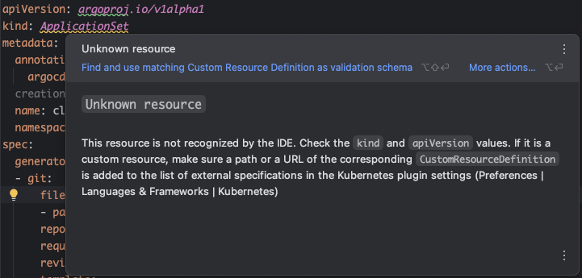
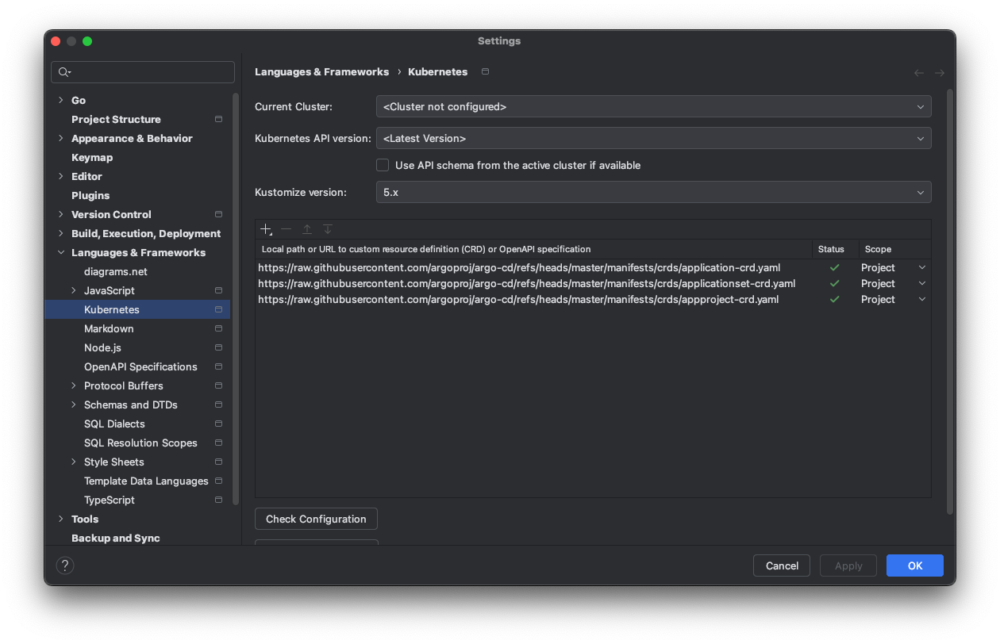

Goland나 IntelliJ 등 Jetbrains IDE에서 ArgoCD Application을 작성할 때, IDE가 모르는 CRD를 
만나면 _Unknown resource_라며 아래 이미지처럼 거슬리게 만드는 경우가 있다.

툴팁에 있는 _Find and use matching Custom Resource Definition as validation schema_ 를
시도해도 IDE가 CRD 정의를 마법처럼 어디선가 긁어오는 것이 아니기에.. 직접 설정을 해줘야 한다.

설정 페이지를 열어 **Language & Frameworks > Kubernetes**에 찾아가보면 CRD에 대한 정의를
추가해줄 수 있는데, 현재 프로젝트에서는 ArgoCD 관련 yaml을 다룰거라 해당 내용만 추가했다.

ArgoCD 깃허브 [https://github.com/argoproj/argo-cd/tree/master/manifests/crds](https://github.com/argoproj/argo-cd/tree/master/manifests/crds)
에 정의된 파일들의 raw content에 대한 URL을 모두 추가해주었다.

이렇게 IDE가 웹에서 가져오도록 URL을 세팅하면 실제 클러스터에 설치된 버전과 IDE가 요구하는 버전이 
맞지 않을 수 있기 때문에, 특정 브랜치로 고정해서 URL을 추가하거나 아예 로컬에 다운받아 설정하는
것도 좋아보인다.