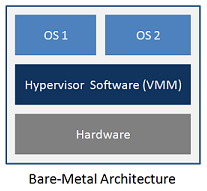
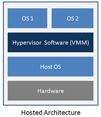
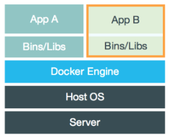
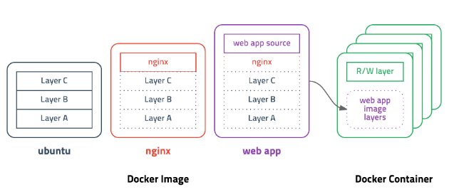
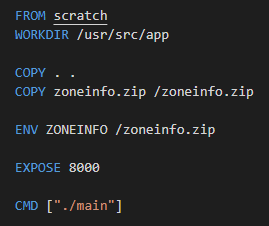

## 1. 도커(*Docker*)란?
컨테이너 기반의 가상화 플랫폼이다.

## 2. 가상화(*Virtualization*)
**물리 리소스를 추상화**하여 사용자에게서 감추며, **여러 개의 논리 리소스**인 것처럼 보이게 하는 기술이다.
가상화 기술로는 VM과 Container 기술이 있다.

### 2.1. VM(*Virtual Machine*)
물리적 HW 리소스를 Hypervisor를 통해 가상화하는 **HW 레벨의 가상화 기술**이다.

### 2.1.1. Bare-Metal (Native) Hypervisor

  

Hypervisor가 호스트 OS를 통하지 않고 HW를 직접 제어한다.
> ex) Xen, Hyper-V, KVM, etc.

### 2.1.2. Hosted Hypervisor

  

일반 SW처럼 호스트 OS 위에서 동작하나, HW 제어는 호스트 OS를 통한다.
상대적으로 오버헤드가 큰 단점이 있다.
> ex) VirtualBox, VMWare, etc.

### 2.2. 컨테이너(*Container*)

  

응용 프로그램의 종속성과 응용 프로그램 자체를 캡슐화한 것이다.
호스트 상에서 프로세스에게 고립된 환경을 제공하는 **OS 레벨의 가상화 기술**이다.

컨테이너의 장점으로는 다음 항목들을 꼽을 수 있다.
- MB 단위의 작은 크기 (VM은 OS가 포함되므로 GB 단위를 넘어간다)
- 필요한만큼 컨테이너를 구동 가능하다. (VM에서는 하나의 OS만을 구동한다.)
- 배포 속도가 매우 빠르다.

단점으로는, 특정 컨테이너가 자원을 많이 사용할 수 있는 문제점이 있다. VM은 정확히 할당할 자원을 세팅이 가능하며 그 안에서만 사용되는데 반해, 컨테이너 환경에서는 제한을 두기 어렵다.

### 3.1. 이미지(*Image*)

이미지는 **컨테이너 실행에 필요한 파일과 설정값 등을 포함**하고 있으며, 이는 상태값을 가지지 않고(*Non-Stateful*) 불변(*Immutable*)하다.
예를 들어 우분투 이미지는 우분투를 구동하기 위한 파일들을 포함하고 있으며, 설정을 선언하고 있다. MySQL 이미지는 우분투 이미지를 기반으로, 그 위에서 추가로 필요한 파일 및 설정을 포함하고 있다.
도커 엔진은 이미지를 기반으로 컨테이너를 실행하게 되는데, 이를 컨테이너 생성을 위한 설계도로 비유가 가능할 것이다.
[Docker Hub](https://hub.docker.com)에서 이미지를 Push, Pull이 가능하다.

### 3.2. 레이어(*Layer*)

컨테이너가 경량화된 가상화 기술이긴 해도 방대한 파일과 설정을 포함해야하기 때문에 이미지의 용량이 클 수밖에 없는데, 이는 레이어의 도입으로 이어졌다.

  

위의 자료 사진에서 web app 이미지는 nginx 이미지를 기반으로 빌드되었는데, 이 nginx 이미지는 ubuntu 이미지를 기반으로 하고 있다.
이 때, web app이 새로운 버전으로 업데이트 되었다고 해서 베이스로 깔고 있는 nginx, ubuntu 이미지까지 모두 다시 pull 하는 것이 아니라, 변함이 없는 부분은 그대로 두고 바뀐 부분만 pull하게 된다.
실제로 도커 이미지가 빌드될 때 레이어를 생성하게 하는 특정 명령들이 있으며, 도커 엔진은 이를 적절한 레이어로 빌드하여 최종적으로 이미지를 생성한다.

### 3.3. Dockerfile

Dockerfile은 도커 이미지를 정의하는 파일이다. 도커 엔진에서 지원하는 언어를 이용해서 이미지 생성 과정을 **서술**한다.

  

### 3.4. 주요 명령들

도커 이용에 필요한 몇 가지 주요 명령들을 나열해 보았다. (자세한 건 구글링~)

- **build** : Dockerfile을 기반으로 이미지를 새로 생성한다. ex) `$ docker build --tag freckie/api .`
- **run** : 이미지로 컨테이너를 생성하여 구동한다. ex) `$ docker run freckie/api`
- **ps** : 현재 구동 중인 컨테이너 목록을 출력한다. ex) `$ docker ps`
- **attach** : 구동 중인 컨테이너에 접속한다. ex) `$ docker attach e29a1ed8db62`
- **exec** : 구동 중인 컨테이너에 명령을 전달한다. ex) `$ docker exec --it e29a1ed8db62`
- **pull** : Docker Hub에서 이미지를 가져온다. ex) `$ docker pull khudasom/dasomapi`