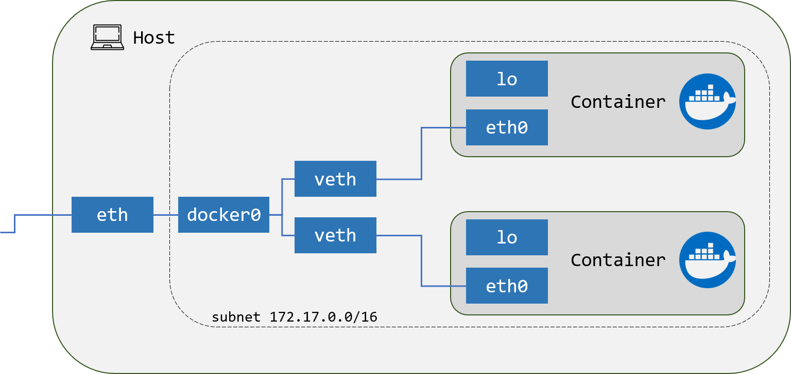

## Docker Network

도커 컨테이너는 기본적으로 `lo`, `eth0` 인터페이스를 가지고 있다.

각 컨테이너의 `eth0`에는 `172.17.0.0/16` 대역의 IP가 할당되는데, 이 대역은 호스트 내부의 사설 IP이므로 외부에서 접속이 불가능하다.

그래서 도커 엔진에서는 호스트에 `veth` 라는 가상 네트워크 인터페이스를 만들고, 각 컨테이너의 `eth0`와 연결한다. 이때, `veth` 인터페이스들은 호스트의 `docker0` 브릿지에 바인딩되어 외부와의 통신을 가능케 한다.

이 `docker0` 브릿지는 도커 컨테이너들의 **게이트웨이** 역할을 한다.

  

## Docker Network Drivers

도커에서 기본으로 제공하는 네트워크 드라이버는 다음이 있다.

- `bridge`
- `host`
- `overlay`
- `none`
- `macvlan`
- Network Plugins (도커에서 제공하지 않는 3rd-party 플러그인)

## Bridge Network

네트워크 드라이버 기본 세팅이다.

도커 엔진 설치 시 기본으로 생성되는 docker0도 브릿지 네트워크이며, 사용자가 직접 브릿지 네트워크를 생성해 적용할 수도 있다.

같은 도커 호스트에서 여러 컨테이너들이 통신할 필요가 있을 때 가장 유용하다.

## Host Network

호스트 네트워크는 컨테이너의 네트워크를 직접 호스트에 연결해 사용하는 방식으로, 컨테이너들의 네트워크가 도커 호스트에서 따로 고립될 필요가 없을 때 사용한다.

## Overlay Network

오버레이 네트워크는 여러 도커 데몬(한 호스트에 여러 데몬 or 여러 호스트)에서 실행되는 컨테이너들을 한 네트워크로 묶는다. Swarm 서비스 사용할 때 사용된다.

## None Network

컨테이너에 모든 네트워크를 비활성화한다. 보통 커스텀 네트워크 드라이버와 같이 구성되어 사용된다. Swarm 서비스에는 사용이 불가능하다.

## Macvlan Network

컨테이너에 MAC 주소를 할당해서, 네트워크에 물리 디바이스로 나타나게 한다.