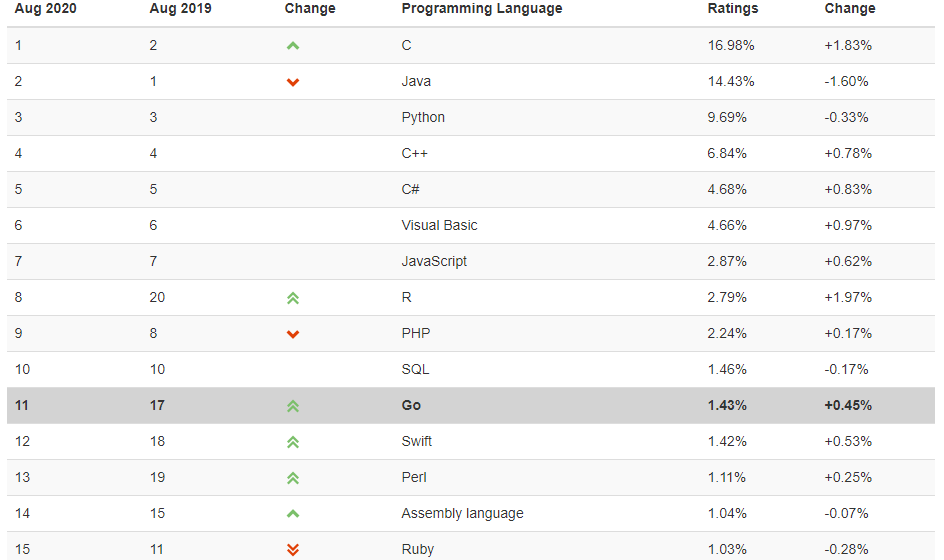

※ 주의

본 포스팅 시리즈는 제가 빠르게 찾아볼 수 있도록 개인적으로 공부하면서 정리했으며, 조사가 미흡해 오류가 있을 수 있습니다.

  
## Go

Go언어는 구글의 로버트 그리즈머(Robert Griesemer), 롭 파이크(Rob Pike), 켄 톰슨(Ken Thompson)에 의해 개발되었다. 롭 파이크의 말에 의하면 대규모 소프트웨어 서비스를 제작하고 읽고 디버깅하는 개발자들을 위해 설계되었다고 한다.

첫 버전은 2009년 10월에 공개되었고, 2016년 이후로는 2월, 8월에 메이저 업데이트가 있다.

2020년 8월 기준으로 최신 메이저 버전은 이번에 공개된 1.15이며, Go 2 버전도 계속 논의되고 있는 듯 하다.

※ Go라는 단어가 가지는 의미가 많다보니 구글에서 검색하려면 golang이라는 키워드를 사용하는 것이 편하다.

  
## 특징

랭킹으로 보는 Go의 최근 동향
  
  

- [Tiobe Index](https://www.tiobe.com/tiobe-index/) 11위 (2020년 8월 기준, 1년 전에 비해 7단계 상승)
- [github star 3위](https://madnight.github.io/githut/#/stars/2020/1) (2020년 1분기 기준)

Go를 주로 사용하는 오픈소스 프로젝트들로는 *Docker*, *Kubernetes*, *Prometheus*, *InfluxDB* 등이 있으며 클라우드쪽 분야에서 특히 선호하는 듯하다. (중국에서도 많은 인기를 끄는 것 같다)

언어 설계 측면

- 문법적으로 C와 유사함. (정적 타입, 코드를 묶는데 중괄호를 사용하는 등)
- Python 등 동적 타이핑 언어처럼 좋은 **생산성**, **가독성**.
- class가 없으며 상속 등의 개념도 없음. 다만 `struct`와 `interface`가 있음.
- 빠른 컴파일 속도.
- 가비지 컬렉션의 존재.

    (C를 완전히 대체하기가 어려운 이유 중 하나)

- **고루틴**(매우 경량화된 쓰레드의 일종)과 **채널**의 존재.

    → 매우 쉬운 동시성 프로그래밍

    → 네트워킹, 멀티프로세싱 등에 고효율

- 원격 저장소에서 바로 가져와 임포트할 수 있는 패키지 시스템.

  
## 설치

[https://golang.org/dl/](https://golang.org/dl/)

  
## 공부에 도움될 자료들

- [http://pyrasis.com/go.html](http://pyrasis.com/go.html)

    → 한국어 작성으로, 차근차근 따라하면서 공부하기 좋다. 이 블로그 토대로 책도 집필하신 것 같다.

- [https://play.golang.org](https://play.golang.org/)

    → IDE 없이 간단히 문법 공부하는 용도로 사용하기 좋다.

- [[Go 동시성 프로그래밍]](http://www.acornpub.co.kr/book/concurrency-in-go), Katherine Cox-Buday 저

    → Go에 웬만큼 적응했을 때 읽기 좋다. 동시성에 대한 개념과 여러 패턴 및 테크닉을 소개한다.

  
## References

- [https://www.infoworld.com/article/3442978/10-open-source-projects-proving-the-power-of-google-go.html](https://www.infoworld.com/article/3442978/10-open-source-projects-proving-the-power-of-google-go.html)
- [https://kuree.gitbooks.io/the-go-programming-language-report](https://kuree.gitbooks.io/the-go-programming-language-report)
- [https://en.wikipedia.org/wiki/Go_(programming_language)](https://en.wikipedia.org/wiki/Go_(programming_language))
- [https://qarea.com/blog/the-evolution-of-go-a-history-of-success](https://qarea.com/blog/the-evolution-of-go-a-history-of-success)