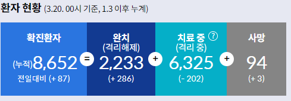
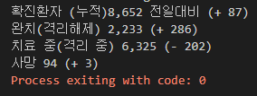

[Tiobe 랭킹](https://www.tiobe.com/tiobe-index/)에 따르면 GoLang은 2020년 3월 기준으로 10위에 랭크되어있다.

많은 사용자가 있고 GoLang으로 작성된 프로젝트도 상당히 많아진만큼 괜찮은 언어임에는 이견이 없지만.. 사용에 있어서 언어 자체가 괜찮은 것과는 달리 큰 문제점이 있다.

**바로 레퍼런스의 부족**이다.

한글 문서의 부족은 말할 것도 없고, 심지어 영어 문서도 부족한 경우가 많다.

다만 GoLang이 중국에서는 꽤나 큰 인기를 얻는지 중문으로 된 글은 많지만 중국어와는 거리가 멀어 전혀 도움이 되지 않았다.

(비교적 신생 언어라 이해는 하지만 ㅠㅠ)

개인적으로 제일 많이 사용하는 언어라, 조금이나마 도움이 되고자 GoLang에 관련된 글을 많이 작성하려고 한다.


## PuerkitoBio/goquery

파이썬을 유저들 대부분은 [BeautifulSoup](https://www.crummy.com/software/BeautifulSoup/)을 이용해 웹 스크래핑, 크롤링 등을 진행해본 경험이 있을 것이다.

간단히 기능에 대해 요약하자면, BeautifulSoup은 HTML이나 XML 소스를 파싱해 트리 형태로 만들어 순회하면서 데이터를 추출하는 용도의 라이브러리이다.

파이썬의 BeautifulSoup만큼 압도적인 위상을 지니고 있는지는 모르겠지만 GoLang에도 HTML 파싱을 위한 [goquery(링크)](https://github.com/PuerkitoBio/goquery)라는 라이브러리가 있다.

`goquery`는 `net/http` 기본 라이브러리와 CSS Selector 라이브러리인 [Cascadia](https://github.com/andybalholm/cascadia) 를 기반으로 개발되었으며 jQuery와 문법 및 기능이 유사하게 개발되었다고 한다.

다음 명령으로 설치하자.

~~~bash
$ go get github.com/PuerkitoBio/goquery
~~~

(본 포스팅에서는 Go 1.13 버전과 goquery 1.5 버전(2018.11)을 기준으로 작성되었습니다.)


## 간단한 예제

우선, 간단한 예제로 COVID-19 현황을 제공하는 정부 사이트의 현황판을 파싱해보았다.  

  

(타겟 사이트 : [http://ncov.mohw.go.kr/](http://ncov.mohw.go.kr/))

~~~go
package main

import (
 "fmt"
 "log"
 "net/http"

 "github.com/PuerkitoBio/goquery"
)

func main() {
 // Request
 url := "http://ncov.mohw.go.kr/"
 resp, err := http.Get(url)
 if err != nil {
  log.Fatal(err)
 }
 defer resp.Body.Close()

 // HTML 읽기
 html, err := goquery.NewDocumentFromReader(resp.Body)
 if err != nil {
  log.Fatal(err)
 }

 // 현황판 파싱
 wrapper := html.Find("ul.liveNum")
 items := wrapper.Find("li")

 // items 순회하면서 출력
 items.Each(func(idx int, sel *goquery.Selection) {
  title := sel.Find("strong.tit").Text()
  value := sel.Find("span.num").Text()
  before := sel.Find("span.before").Text()

  fmt.Println(title, value, before)
 })
}
~~~

아웃풋은 다음과 같다.

  


## request

`net/http` 기본 패키지를 이용해서 request를 보냈다.

만약 User-Agent 등의 헤더를 추가해 보내고 싶다면, 다음 방법을 이용하자.

~~~go
// Request
req, err := http.NewRequest("GET", url, nil)
if err != nil {
 log.Fatal(err)
}
req.Header.Add("User-Agent", "Crawler")

client := &http.Client{}
resp, err := client.Do(req)
if err != nil {
 log.Fatal(err)
}
defer resp.Body.Close()
~~~


## CSS Selector

`Find()` 함수에는 string으로 CSS Selector를 전달한다.

다음은 CSS Selector의 몇가지 예시다.

- `ul`
    - ```<ul> ... </ul>```
- `ul.liveNum`
    - ```<ul class="liveNum"> ... </ul>```
- `ul#id`
    - ```<ul id="id"> ... </ul>```
- `li > strong.tit`
    - ```<li> <strong class="tit"> ... </strong> </li>```


## 검색 : Find()

파이썬의 BeautifulSoup에서는 find()와 find_all() 함수가 있었는데, 전자는 처음으로 발견된 검색 결과를 리턴하고 후자는 검색 결과를 리스트로 리턴했다.

goquery에서 `Find()` 함수는 해당되는 노드를 전부 탐색하며, `*goquery.Selection` 구조체를 리턴한다.

(자세한 정보는 [godoc 문서](https://godoc.org/github.com/PuerkitoBio/goquery#Selection)를 참조)

이를 순회하기 위해서 `.Each()`를 사용한다.


## 노드 순회 : Each()

`Each()`에는 파라미터로 `func(int, *goquery.Selection)`이 요구된다.

노드를 순회하면서 파라미터로 들어온 함수를 실행하게 된다.

```go
fmt.Printf("검색된 결과 : %d개\n", items.Length())

items.Each(func(idx int, sel *goquery.Selection) {
 fmt.Println("현재 위치 :", idx)
 fmt.Println("현재 태그 :", goquery.NodeName(sel))
})
```

(`goquery.NodeName()` 함수는 해당 노드의 태그 이름을 리턴한다)


## 노드 순회 : EachWithBreak()

순회 방법에는 `Each()` 외에도 `EachWithBreak()`가 존재한다.

특정 조건에서 순회를 멈추고 그 Selection을 전달받고 싶을 때 사용한다.

```go
var title string
items.Each(func(idx int, sel *goquery.Selection) bool {
 title = sel.Find("strong.tit").Text()
 if title == "치료 중(격리 중)" {
  return false
 }
 return true
})
```


## 텍스트 추출

해당 태그 내의 모든 텍스트를 추출하려면 지금까지 자연스럽게 사용한 `.Text()` 함수를 호출하면 된다.

만약, 해당 태그 내에서 바로 밑의 자손 텍스트만 출력하기 위해서는 다음과 같이 사용한다.

```go
wrapper.Contents().Each(func(idx int, sel *goquery.Selection) { // Contents()는 바로 밑의 자손들
 if goquery.NodeName(sel) == "#text" { // 태그가 없는 단순 텍스트
  fmt.Println(sel.Text())
 }
})
```


## 속성 추출

태그의 속성을 추출할 때, 다음과 같이 사용한다.

```go
aTag := item.Find("a")
href, ok := aTag.Attr("href") // 속성값 추출
if !ok {
 fmt.Println("href 없음.")
}
```


## 마무리

GoLang의 HTML 파싱 라이브러리인 `PuerkitoBio/goquery`에 대해 살펴보았다.

경험상, 본 포스팅에 소개된 함수들만 이용해도 원하는 데이터를 추출하는데 큰 지장은 없던 것 같다.