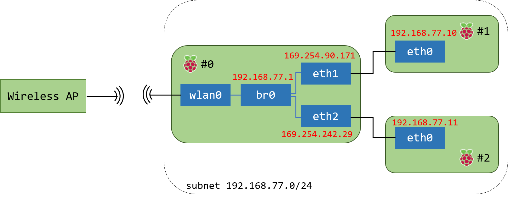

[라즈베리파이로 유선 사설 네트워크 구축](https://blog.frec.kr/2020/07/17/20200717-1/)할때, 인터페이스 두 개(`eth1`, `eth2`)를 브릿지로 묶어 구성했었다.

Worker(RPi #1, #2)들의 IP는 DHCP 설정한대로 `192.168.77.0/24` 대역을 할당받았지만, `br0` 브릿지에 묶인 `eth1`, `eth2`는 `169.254.0.0/16` 대역의 IP를 가지고 있었다.

  
  

## 169.254.0.0/16

[IETF](https://tools.ietf.org/html/rfc3927)에 따르면, `eth1`과  `eth2`에 할당됐던 `169.254.0.0/16` 대역의 IP 주소는 DHCP 서버를 찾을 수 없는 경우 동적으로 부여되는 **Link-Local Address**였다.

여기서 DHCP 서버는 `br0`에 할당하도록 설정해뒀으니 `eth1`, `eth2`에서는 DHCP를 찾을 수 없어 해당 대역이 할당된 것으로 보인다.

이 대역의 주소는 단일 세그먼트 네트워크에서만 유효하며 routing은 불가능하다.
  
  
## References

- [https://kb.iu.edu/d/aoyj](https://kb.iu.edu/d/aoyj)
- [https://tools.ietf.org/html/rfc3927](https://tools.ietf.org/html/rfc3927)