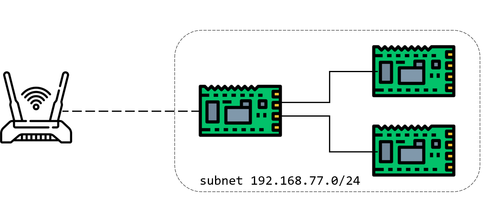
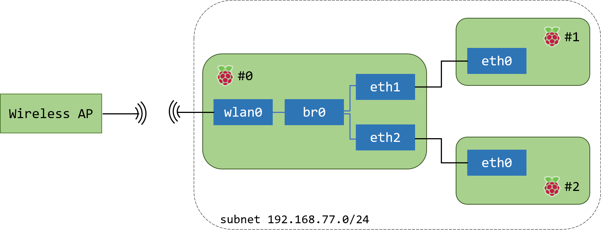

수정사항

> 2020-07-18 01:50 :: 누락되었던 bridge 설정 섹션 추가  
> 2020-07-21 14:48 :: Goal 이미지 추가, 결과 이미지 추가, 순서 일부 변경  
> 2020-12-14 02:50 :: 설명 한 줄 추가

## Goal 🏀

  

```
                                         +- RPi #1 ------+
                                     +---+ 192.168.77.10 |
                                     |   | {eth0}        |
                                     |   +---------------+
                 +- RPi #0------+    |
                 | DHCP  Server +----+ {eth1}
(Internet)   (((-+ {wlan0}      |
                 | 192.168.77.1 +----+ {eth2}
                 +--------------+    | 
                                     |   +- RPi #2 ------+
                                     +---+ {eth0}        |
                                         | 192.168.77.11 |
                                         +---------------+
```

- 외부 AP와 연결된 RPi #0은 일종의 유선 공유기 역할로, Worker들이 eth로 연결 시 IP 주소를 할당.
- 다만 eth로 연결되는 공유기와 다르게, RPi #0은 wlan0으로 AP와 연결됨.
- Worker들의 MAC 주소를 참조하여 **고정된 사설IP**를 제공해야 함.

## 필요한 패키지 설치

```bash
$ sudo apt install -y vim bridge-utils
```

## bridge 설정

```bash
$ sudo brctl addbr br0
$ sudo brctl addif br0 eth1 eth2
$ sudo ifconfig br0 192.168.77.1
$ sudo ifconfig br0 up
```

(이 설정은 재부팅 시마다 계속 다시 하고, `$ sudo systemctl restart dnsmasq`  명령으로 dnsmasq도 다시 시작해야한다.  
`/home/pi`에 `bridge-setup.sh`로 저장하고 `crontab`을 이용해서 부팅시에 자동 실행되도록 추가했다.)
  
## dhcpcd.conf 설정

`/etc/dhcpcd.conf`

```
interface br0
static ip_address=192.168.77.1/24
```
  
## netfilter 설정

```bash
$ sudo iptables -t nat -A POSTROUTING -o wlan0 -j MASQUERADE

$ sudo iptables -A FORWARD -i eth1 -o wlan0 -m state --state RELATED,ESTABLISHED -j ACCEPT
$ sudo iptables -A FORWARD -i eth1 -o wlan0 

$ sudo iptables -A FORWARD -i eth2 -o wlan0 -m state --state RELATED,ESTABLISHED -j ACCEPT
$ sudo iptables -A FORWARD -i eth2 -o wlan0 

$ sudo iptables -A FORWARD -i br0 -o wlan0 -m state --state RELATED,ESTABLISHED -j ACCEPT
$ sudo iptables -A FORWARD -i br0 -o wlan0 

$ sudo apt install iptables-persistent netfilter-persistent
$ sudo systemctl enable netfilter-persistent
```
  
## dnsmasq 설치 및 세팅

```bash
$ sudo apt install dnsmasq
$ sudo mv /etc/dnsmasq.conf /etc/dnsmasq.conf.backup # 기존 config 파일 백업
$ sudo vim /etc/dnsmasq.conf
```

`/etc/dnsmasq.conf`

```
resolv-file=/etc/resolv.dnsmasq
interface=br0
dhcp-range=192.168.77.10,192.168.77.100,255.255.255.0,infinite
```

- `resolv-file` : dns 서버 설정 파일 지정
- `interface` : dhcp 서버를 구동할 인터페이스 설정
- `dhcp-range` : dhcp 서버에서 할당할 IP 범위 지정, subnet mask 지정, 대여 시간(무한=infinite)
  
## DNS 설정

`/etc/resolv.conf` (기존 파일 수정)

```bash
nameserver 192.168.77.1
```

`/etc/resolv.dnsmasq` (파일 새로 생성)

```bash
nameserver 8.8.8.8
```

```bash
$ sudo systemctl restart dnsmasq
```

여기까지 했을 때 worker들에서 dns query도 성공하고 잘 동작하는 듯 한데, 외부 인터넷 접속이 안 된다.

bridge의 패킷이 netfilter에 제대로 걸리지 않는 느낌.
그래서 다음을 추가로 진행했다.
  
## iptables 확인

```bash
$ sudo iptables -L -v
```

위 명령으로 확인해본 결과 bridge의 나가는 패킷, 들어오는 패킷이 전부 0으로, 아예 구동하지 않는 듯 했다.

`/proc/sys/net/ipv4/ip_forward` 에 1을 설정했던 것처럼

`/proc/sys/net/bridge/bridge-nf-call-iptables`, `/proc/sys/net/bridge/bridge-nf-call-arptables` 를 모두 1로 설정했다.

No such file or directory 에러가 뜨는데,

`/etc/sysctl.conf`

```bash
net.ipv4.ip_forward=1 # 기존 주석 해제
net.bridge.bridge-nf-call-arptables=1 # 새로 추가
net.bridge.bridge-nf-call-iptables=1 # 새로 추가
```

```bash
$ sudo sysctl -p # 에러 발생함.

$ sudo modprobe br_netfilter
$ sudo lsmod | grep br_netfilter

$ sudo sysctl -p # 완료
```
  
## 결과

  
  

## References

전체적인 흐름

- [https://hook.tistory.com/entry/데비안-리눅스-머신-또는-라즈베리파이를-유선랜-라우터-만들기](https://hook.tistory.com/entry/%EB%8D%B0%EB%B9%84%EC%95%88-%EB%A6%AC%EB%88%85%EC%8A%A4-%EB%A8%B8%EC%8B%A0-%EB%98%90%EB%8A%94-%EB%9D%BC%EC%A6%88%EB%B2%A0%EB%A6%AC%ED%8C%8C%EC%9D%B4%EB%A5%BC-%EC%9C%A0%EC%84%A0%EB%9E%9C-%EB%9D%BC%EC%9A%B0%ED%84%B0-%EB%A7%8C%EB%93%A4%EA%B8%B0)

dns

- [https://sysops.tistory.com/84](https://sysops.tistory.com/84)

dnsmasq

- [http://www.thekelleys.org.uk/dnsmasq/docs/dnsmasq-man.html](http://www.thekelleys.org.uk/dnsmasq/docs/dnsmasq-man.html)
- [https://www.linux.com/topic/networking/dns-and-dhcp-dnsmasq/](https://www.linux.com/topic/networking/dns-and-dhcp-dnsmasq/)

bridge
- [https://unix.stackexchange.com/questions/319979/why-assign-mac-and-ip-addresses-on-bridge-interface](https://unix.stackexchange.com/questions/319979/why-assign-mac-and-ip-addresses-on-bridge-interface)
- [https://www.element14.com/community/thread/33724/l/multiple-ethernet-ports-on-the-raspberry-pi?displayFullThread=true](https://www.element14.com/community/thread/33724/l/multiple-ethernet-ports-on-the-raspberry-pi?displayFullThread=true)
- [https://raspberrypi.stackexchange.com/questions/34968/bridge-eth0-and-eth1-and-run-dnsmasq](https://raspberrypi.stackexchange.com/questions/34968/bridge-eth0-and-eth1-and-run-dnsmasq)

iptables bridge forward 설정

- [https://ablog.jc-lab.net/14](https://ablog.jc-lab.net/14)
- [https://m.blog.naver.com/woomun/220743262815](https://m.blog.naver.com/woomun/220743262815)