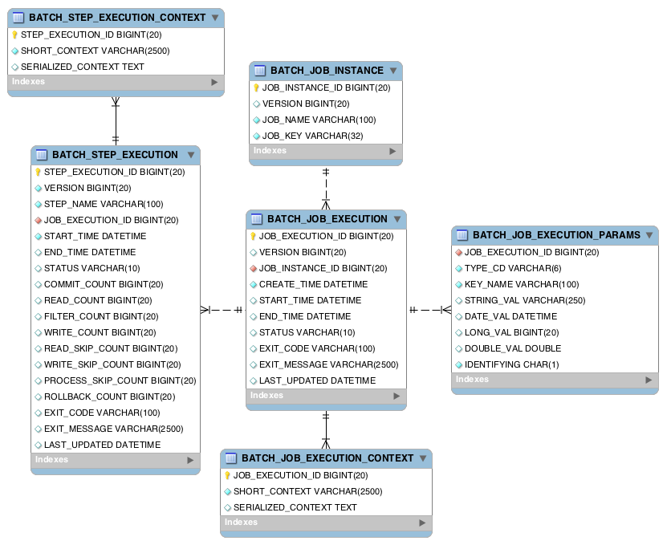

## 스프링 배치 메타데이터

- 스프링 배치에서는 `Job`과 `Step`의 실행 상태, 파라미터, 컨텍스트 등을 관리하기 위해 메타데이터 테이블을 필요로 한다. [1]

- 메타데이터 엔티티들은 `JobInstance`, `JobExecution`, `JobParameters`, `StepExecution` 등이 있고, 이들을 관리하는 테이블들은 총 6개로 다음과 같다.
    - `BATCH_JOB_INSTANCE` : Job이 실행될 때마다 생성된 JobInstance
    - `BATCH_JOB_EXECUTION` : JobInstance의 시작/종료 시간, 상태, 종료 메세지 등 정보
    - `BATCH_JOB_EXECUTION_PARAMS` : JobExecution에 전달되는 JobParameters
    - `BATCH_JOB_EXECUTION_CONTEXT` : Job 범위에서 관리하는 컨텍스트가 serialize되어 기록됨.
    - `BATCH_STEP_EXECUTION` : Job 하위 Step들의 시작/종료 시간, 상태, read/write/skip/commit 카운트 등 상세한 정보
    - `BATCH_STEP_EXECUTION_CONTEXT` : Step 범위에서 관리하는 컨텍스트가 serialize되어 기록됨.
    



(이미지 출처 : [https://docs.spring.io/spring-batch/docs/current/reference/html/schema-appendix.html](https://docs.spring.io/spring-batch/docs/current/reference/html/schema-appendix.html))

<br>

**문제 상황**

- 배치 Job에서 사용하는 서비스 DB에 배치 메타데이터 테이블이 위치하는 것이 바람직하지 않을 수 있다.
- 혹은 비주류 DB에 메타데이터를 저장하려 할 경우, 스프링 배치에서 지원하지 않을 수 있다. [2] (ex. Tibero)
    - 지원하는 DB: DB2, Derby, H2, HANA, HSQL, MariaDB, MySQL, Postgres, Sqlite, SqlServer, Sybase

## 메타데이터 DB 분리하기 (Spring Batch 5.0 이전)

웹에서 찾아보면 주로 다음 솔루션이 보인다.

- `DefaultBatchConfigurer`를 구현하고 DataSource를 설정하는 부분을 비워두는 방법
    - ex) [https://stackoverflow.com/a/42677607](https://stackoverflow.com/a/42677607)
    - DataSource가 설정되지 않을 때, 스프링 배치는 `MapJobRepositoryFactoryBean`을 이용해 메타데이터를 **Map 기반으로 인메모리 관리**한다.
        - 이 경우 Thread-safe하지 않아 Job을 병렬로 구동할 경우 문제가 발생할 수 있으며,
        - 퍼포먼스 또한 형편없어서 deprecated 처리되었다. [3]
    - 또한 Spring Batch 5.0에서는 DefaultBatchConfigurer가 제거되어 이 방법을 사용할 수 없는데,
        - 대체로 생긴 DefaultBatchConfiguration은 DataSource 설정을 지원하지 않는다.

## Spring Batch 5.0에서

- `@EnableBatchProcessing` 어노테이션은 5.0 버전에서 몇가지 변경점이 있다.
    - dataSourceRef 속성을 통해 DataSource 빈을 직접 지정해줄 수 있고,
    - transactionManagerRef 속성을 통해 TransactionManager 빈을 직접 지정할 수 있다.

- Configuration에서 DataSource 빈을 두 개 등록해주고 서비스 데이터가 들어갈 데이터소스에 `@Primary` 어노테이션을 설정해두었다.
    - 다음 BatchConfig.java 코드와 같이 batch 메타데이터가 저장될 데이터소스(batchDataSource)를 따로 생성하였다.
- TransactionManager 빈을 등록할 때 사용할 데이터소스를 지정해주었으며,
    - 최종적으로 JobConfig에서 `@EnableBatchProcessing(dataSourceRef = "batchDataSource", transactionManagerRef = "jpaTransactionManager")` 어노테이션을 통해 두 데이터소스를 분리 지정했다.

- 추가로, batchDataSource 빈을 `EmbeddedDataSource`로 구성하여 H2와 같은 인메모리 DB를 사용할 수 있다.

전체 코드는 다음과 같다.

`config/BatchConfig.java`

```java
@Configuration
public class BatchConfig {

    @Value("${spring.datasource.url}")
    private String url;

    @Value("${spring.datasource.username}")
    private String username;

    @Value("${spring.datasource.password}")
    private String password;

    @Value("${spring.datasource.driver-class-name}")
    private String driverClassName;

    @Value("${spring.datasource-batch.url}")
    private String batchUrl;

    @Value("${spring.datasource-batch.username}")
    private String batchUsername;

    @Value("${spring.datasource-batch.password}")
    private String batchPassword;

    @Value("${spring.datasource-batch.driver-class-name}")
    private String batchDriverClassName;

    @Bean
    @Primary
    public DataSource dataSource() {
        return DataSourceBuilder.create()
                .url(url)
                .username(username)
                .password(password)
                .driverClassName(driverClassName)
                .build();
    }

    @Bean
    public DataSource batchDataSource() {
        return DataSourceBuilder.create()
                .url(batchUrl)
                .username(batchUsername)
                .password(batchPassword)
                .driverClassName(batchDriverClassName)
                .build();
    }

    @Bean
    public PlatformTransactionManager jpaTransactionManager(EntityManagerFactory entityManagerFactory) {
        JpaTransactionManager jpaTransactionManager = new JpaTransactionManager(entityManagerFactory);
        jpaTransactionManager.setDataSource(dataSource());
        return jpaTransactionManager;
    }
}
```

`JobConfig`

```java
@Configuration
@RequiredArgsConstructor
@EnableBatchProcessing(dataSourceRef = "batchDataSource", transactionManagerRef = "jpaTransactionManager")
public class DailyAggregationJobConfig {

    private final static String jobName = "dailyAggregationJob";

    private final JobRepository jobRepository;
    private final PlatformTransactionManager jpaTransactionManager;
    private final EntityManagerFactory entityManagerFactory;

    @Bean
    @Qualifier(jobName)
    public Job dailyAggregationJob() {
        return new JobBuilder(jobName, jobRepository)
                .start(dailyAggregationStep1())
                .build();
    }

    @Bean
		@JobScope
    public Step dailyAggregationStep1() {
        return new StepBuilder(jobName + "Step1", jobRepository)
                .<DailyAggregationVo, DailyAggregatedData>chunk(1000, jpaTransactionManager)
                .reader(dailyAggregationItemReader())
                .processor(dailyAggregationItemProcessor())
                .writer(dailyAggregationItemWriter())
                .build();
    }

    @Bean
		@StepScope
    public DailyAggregationItemReader dailyAggregationItemReader() {
        return new DailyAggregationItemReader(entityManagerFactory);
    }

    @Bean
		@StepScope
    public DailyAggregationItemReader dailyAggregationItemProcessor() {
        return new DailyAggregationItemReader();
    }

    @Bean
		@StepScope
    public DailyAggregationItemReader dailyAggregationItemWriter() {
        return new DailyAggregationItemReader(entityManagerFactory);
    }
}
```

`resources/application.yaml`

```java
spring:
	// ...
  datasource:
    driver-class-name: org.mariadb.jdbc.Driver
    url: jdbc:mariadb://localhost:20000/playground?characterEncoding=UTF-8&serverTimezone=Asia/Seoul
    username: username
    password: password
  datasource-batch:
    driver-class-name: org.mariadb.jdbc.Driver
    url: jdbc:mariadb://localhost:20001/batch_metadata?characterEncoding=UTF-8&serverTimezone=Asia/Seoul
    username: username
    password: password
	// ...
```

## References

- [1] [https://docs.spring.io/spring-batch/docs/current/reference/html/schema-appendix.html](https://docs.spring.io/spring-batch/docs/current/reference/html/schema-appendix.html)

- [2] org.springframework.batch.support.DatabaseType ([https://docs.spring.io/spring-batch/docs/current/api/org/springframework/batch/support/DatabaseType.html](https://docs.spring.io/spring-batch/docs/current/api/org/springframework/batch/support/DatabaseType.html))

- [3] [https://github.com/spring-projects/spring-batch/issues/3780](https://github.com/spring-projects/spring-batch/issues/3780)
